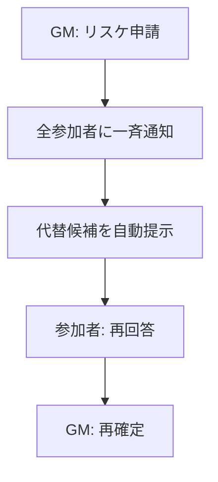
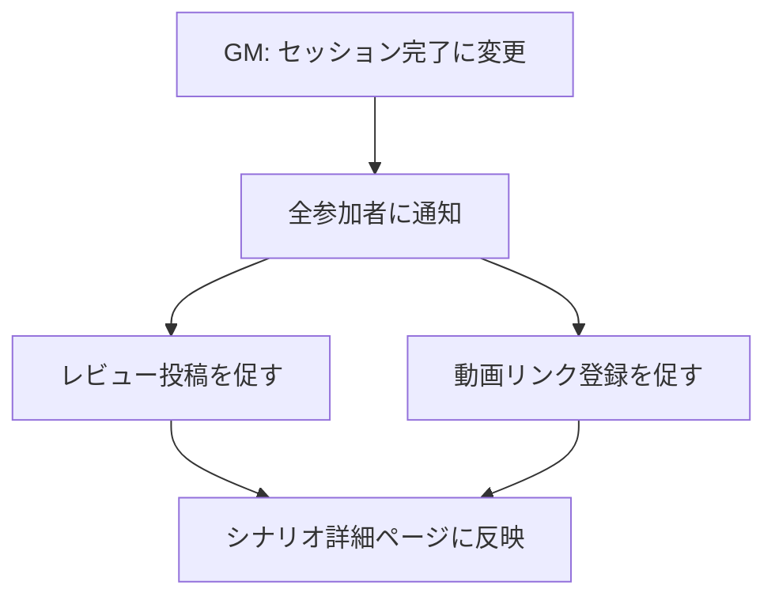

# セッションフロー詳細要件定義書

**対象範囲**: セッション募集 → 日程調整 → 進行 → 終了までの一連の流れ

**作成日**: 2026-01-21

**情報源**:
- Web調査（Twitter/X、TRPG掲示板、はてな匿名ダイアリー等）
- 競合分析（TRPGオンセン、TALTO等）
- ユーザーヒアリング

---

## 目次

- [1. 概要](#1-概要)
- [2. Web調査から見えた課題](#2-web調査から見えた課題)
- [3. セッション募集](#3-セッション募集)
  - [3.6 キャンセル・辞退フロー](#36-キャンセル辞退フロー)（New）
- [4. 日程調整](#4-日程調整)
- [5. セッション進行](#5-セッション進行)
  - [5.3 未定情報の更新フロー](#53-未定情報の更新フロー)（New）
- [6. セッション終了後](#6-セッション終了後)
- [7. データモデル](#7-データモデル)
  - [7.7 バリデーションルール](#77-バリデーションルール)（New）
- [8. 実装優先度](#8-実装優先度)
- [9. 未決定事項](#9-未決定事項)
  - [9.4 既存機能との整合性](#94-既存機能との整合性)（New）

---

## 1. 概要

### 1.1 目的

日本のTRPGプレイヤーが抱える**セッション管理の3大課題**を解決する：

1. **「どんな人か分からない」不安** → プロフィール・SNS連携で透明性確保
2. **「日程調整が一番大変」** → 伝助より簡単なカレンダー選択式UI
3. **「情報が分散する」** → キャラシ・動画・日程を一元管理

### 1.2 対象ユーザー

| ペルソナ | 主な課題 | 解決策 |
|----------|----------|--------|
| 田中さん（週末GM） | 日程調整に苦労、リスケ対応が大変 | カレンダーUI、自動通知、代替案提示 |
| 鈴木さん（新人PL） | 知らない人との卓が不安 | プロフィール充実、SNSアカウント表示 |
| 佐藤さん（配信者） | 動画とセッションの紐付けが面倒 | セッション詳細ページに動画リンク一元化 |
| 山田さん（ベテランKP） | 複数卓の管理が煩雑 | セッション一覧のカレンダービュー |

### 1.3 設計原則

| 原則 | 説明 |
|------|------|
| **柔軟性優先** | シナリオ・日程・人数すべてオプション。「この日に遊びたい」「このシナリオで遊びたい」どちらもOK |
| **シンプル第一** | 伝助より簡単、外部ツール不要、3クリック以内で完了 |
| **透明性の確保** | 参加者情報を明示、不安を取り除く |
| **一元管理** | Discord、Googleカレンダー、ココフォリアなど外部ツールと連携しつつ、情報はすべて本システムに集約 |

---

## 2. Web調査から見えた課題

### 2.1 セッション募集の課題

| 課題 | 出典 | 解決策 |
|------|------|--------|
| 「どんな人か分からない不安」 | [TRPGセッションの探し方](https://trpgonsezhuanmensakurudekiusunobenchi.webnode.jp/) | プロフィール充実、SNSアカウント必須 |
| 「募集が多すぎて埋もれる」 | Web検索結果 | おすすめ表示、タグマッチング |
| 「野良卓はキャンセル率が高い」 | はてな匿名ダイアリー | 参加履歴・評価の可視化 |

### 2.2 日程調整の課題

| 課題 | 出典 | 解決策 |
|------|------|--------|
| 「半年〜1年待ちも珍しくない」 | [Yahoo知恵袋](https://detail.chiebukuro.yahoo.co.jp/qa/question_detail/q14250229664) | カレンダーUI、通知機能で回答促進 |
| 「リスケの連鎖で疲弊」 | [はてな匿名ダイアリー](https://anond.hatelabo.jp/20200803155006) | 一斉通知、代替案自動提示、前回回答引き継ぎ |
| 「伝助・調整さんは使いにくい」 | [TRPGのおすすめ予定調整ツール](https://qtaro-to-syuzo.hateblo.jp/entry/trpg-how-to-select-schedule) | カレンダー選択式、直感的UI |
| 「調整さんは19:00が自動挿入される」 | 同上 | デフォルト値なし、または学習機能 |

### 2.3 セッション管理の課題

| 課題 | 出典 | 解決策 |
|------|------|--------|
| 「無視・遅刻・ドタキャンで信頼崩壊」 | [日程調整でトラブルを起こさないために](https://ichijo.hatenablog.com/entry/2023/03/17/180000) | 参加者評価、リマインダー通知 |
| 「情報が分散（Discord、ココフォリア、伝助）」 | 競合分析 | セッション詳細ページに一元化 |

---

## 3. セッション募集

### 3.1 設計思想

**「柔軟な募集」を最優先**

従来の「シナリオ・日程・人数すべて必須」という設計を廃止。以下のパターンをすべて許容：

| パターン | 例 | 必須項目 |
|----------|-----|----------|
| シナリオ決定済み | 「狂気山脈やります！日程調整しましょう」 | シナリオ名 |
| 日程決定済み | 「1/25 20時から遊べる人募集」 | 日時 |
| 人数決定済み | 「4人でCoC7版やりたい、シナリオは相談」 | 募集人数 |
| すべて未定 | 「週末に何か遊びませんか？」 | 募集文のみ |
| メンバー決定済み | 「メンバーは決まっているが、シナリオと日程は未定」 | 参加者のみ |
| GM募集 | 「シナリオは決まっているがGMが未定。GMやってくれる人募集」 | シナリオ名 |

**重要: セッション作成者 ≠ GM**

セッションの作成者は必ずしもGM（KEEPER）とは限らない。以下のケースを想定：

| ケース | 説明 |
|--------|------|
| 作成者がGM | 最も一般的。GMが卓を立てて参加者を募集する |
| 作成者がPL | PLが「このシナリオ遊びたい」と卓を立て、GMを別途募集する |
| 作成者が幹事 | 参加者全員を事前に指定し、シナリオや日程を後から決める |

セッション作成時にGMが決まっている場合は参加者として指定し、未定の場合はGM枠を空けて募集する。

### 3.2 募集フォーム

#### 必須項目

| 項目 | 説明 |
|------|------|
| セッション名 | セッションのタイトル（100文字以内） |
| 募集文 | 自由記述（500文字以内） |

#### オプション項目

| 項目 | 入力形式 | デフォルト |
|------|----------|------------|
| シナリオ | ID入力 / URL貼り付け / 検索モーダル | 未定 |
| 日時 | カレンダー選択 or 「後で調整」 | 未定 |
| 追加募集人数 | 数値入力（1〜10人） | 未定 |
| 使用ツール | テキスト（Discord、ココフォリア等） | 未入力可 |
| 初心者歓迎 | チェックボックス | false |
| 公開範囲 | 「全体公開」「フォロワーのみ」 | 全体公開 |
| 参加者 | @メンション入力で事前指定 | なし |

#### 参加者の事前指定

セッション作成時に、既にメンバーが決まっている場合は参加者を事前に指定できる。

**入力方式**: @メンション型テキスト入力
- `@`を入力すると候補ユーザーがドロップダウンで表示される（debounce付きオートコンプリート）
- TeamsやDiscordの@メンション入力と同様のUX
- 各参加者に対して役割（GM / PL / 観戦）を指定する

**参加者セクションUI**:
```
参加者（任意）
┌──────────────────────────────────────────────┐
│ [@ユーザーを追加...                         ]│
│                                              │
│ 追加済み:                                    │
│ ┌──────────────────────────────────────────┐ │
│ │ 田中太郎  [GM ▼]              [✕]      │ │
│ │ 鈴木花子  [PL ▼]              [✕]      │ │
│ │ 佐藤次郎  [PL ▼]              [✕]      │ │
│ └──────────────────────────────────────────┘ │
└──────────────────────────────────────────────┘

追加募集人数（任意）  ← 事前指定以外に追加で募集する人数
[  2  ] 人
```

**事前指定された参加者の扱い**:
- ステータスは `CONFIRMED`（承認済み）で即座に登録される
- 対象ユーザーには「セッションに追加されました」通知が送信される
- 辞退する場合は通常の辞退フローを利用する

**追加募集人数の意味**:
- 事前指定された参加者に加え、さらに募集する人数
- 例: 3人事前指定 + 追加募集2人 = 最大5人のセッション
- 追加募集が不要な場合は空欄（= 事前指定メンバーのみ）

#### シナリオ選択

シナリオの指定は3つの方法を提供する：

| 方法 | 説明 | ユースケース |
|------|------|-------------|
| ID入力 | シナリオIDを直接入力 | IDを知っている場合（シナリオページからコピー） |
| URL貼り付け | シナリオページのURLを貼り付け | ブラウザからURLをコピペ |
| 検索モーダル | 条件を絞り込んで検索 | シナリオを探したい場合 |

**検索モーダルのスマートフィルタ**:

参加者が事前指定されている場合、以下のスマートフィルタが使用可能：

| フィルタ | 説明 | 条件 |
|----------|------|------|
| 参加者全員が未プレイ | 全員がまだプレイしていないシナリオのみ表示 | 参加者指定時のみ有効 |
| 指定GMがKP可能 | GM指定済みの場合、そのGMがKP可能なシナリオのみ | GM指定時のみ有効 |
| メンバーが所有 | 参加者の誰かが所有しているシナリオのみ | 参加者指定時のみ有効 |

通常のフィルタ（システム、タグ、プレイ人数等）も併用可能。

#### UI構成

```
┌─────────────────────────────────────────────────────┐
│ セッション募集                                      │
├─────────────────────────────────────────────────────┤
│ セッション名（必須）                                │
│ [週末CoC7版セッション                      ]       │
│                                                     │
│ 募集文（必須）                                      │
│ ┌─────────────────────────────────────────────────┐ │
│ │ 週末にCoC7版を遊びませんか？                    │ │
│ │ 初心者歓迎、シナリオは相談で決めましょう！      │ │
│ └─────────────────────────────────────────────────┘ │
│                                                     │
│ 参加者（任意）                                      │
│ [@ユーザーを追加...                          ]     │
│ 田中太郎 [GM▼] [✕]  鈴木花子 [PL▼] [✕]          │
│                                                     │
│ シナリオ（任意）                                    │
│ [ID入力] [URL貼り付け] [検索して選ぶ]             │
│                                                     │
│ 日時（任意）                                        │
│ ○ 後で調整   ● 日時を指定                         │
│   → [2026/01/25] [20:00]〜                        │
│                                                     │
│ 追加募集人数（任意）                                │
│ [  2  ] 人                                         │
│                                                     │
│ 使用ツール（任意）                                  │
│ [Discord + ココフォリア                   ]        │
│                                                     │
│ [✓] 初心者歓迎                                     │
│                                                     │
│ 公開範囲                                            │
│ ○ 全体公開   ○ フォロワーのみ                     │
│                                                     │
│ [募集を投稿する]  [下書き保存]                     │
└─────────────────────────────────────────────────────┘
```

### 3.3 募集一覧表示

#### カード表示情報

| 項目 | 表示例 | 優先度 |
|------|--------|--------|
| 募集文（冒頭） | 「週末にCoC7版を遊びませんか？...」 | 必須 |
| シナリオ名 | 「狂気山脈」 or 「未定」 | 必須 |
| 日時 | 「2026/01/25（土）20:00〜」 or 「日程調整中」 | 必須 |
| 主催者/GM | 「田中太郎（GM）」 or 「山田三郎（GM募集中）」 | 必須 |
| 募集状況 | 「残り1枠（3/4人）」 or 「人数未定」 | 必須 |
| 初心者歓迎バッジ | 初心者歓迎アイコン | 高 |
| 参加申請ボタン | 「参加する」 | 必須 |

#### フィルタ・ソート

| 条件 | 選択肢 |
|------|--------|
| システム | マルチセレクト |
| 日時 | 「今週末」「来週」「今月」「日付指定」 |
| 初心者歓迎 | チェックボックス |
| シナリオ決定済み | チェックボックス |
| 日程確定済み | チェックボックス |

| ソート | 説明 |
|--------|------|
| 新着順 | デフォルト |
| 開催日順（近い順） | 日程確定済みのみ |
| 残り枠順 | 空き枠の多い順 |

### 3.4 参加申請

#### 申請フォーム

```
┌─────────────────────────────────────────────────────┐
│ セッションに参加申請                                │
├─────────────────────────────────────────────────────┤
│ 作成者: 山田三郎                                    │
│ シナリオ: 狂気山脈                                  │
│ 日時: 日程調整中                                    │
│                                                     │
│ 参加タイプ:                                         │
│ ○ GMとして参加                                     │ ← GM未定の場合のみ表示
│ ● プレイヤーとして参加                             │
│ ○ 観戦者として参加                                 │
│                                                     │
│ 一言メッセージ（任意）                              │
│ ┌─────────────────────────────────────────────────┐ │
│ │ よろしくお願いします！CoC7版は初心者です。      │ │
│ └─────────────────────────────────────────────────┘ │
│                                                     │
│ ※ あなたのプロフィールが主催者に表示されます       │
│                                                     │
│ [申請を送る]  [キャンセル]                         │
└─────────────────────────────────────────────────────┘
```

**参加タイプの説明**:
| タイプ | DB値 | 説明 | 表示条件 |
|--------|------|------|----------|
| GM | KEEPER | セッションのゲームマスターとして参加する | GM未定の場合のみ表示 |
| プレイヤー | PLAYER | セッションに参加してキャラクターを操作する | 常時表示 |
| 観戦者 | SPECTATOR | セッションを見学のみ（キャラシ不要） | 常時表示 |

**GM申請に関する補足**:
- GM枠が既に埋まっている場合、「GMとして参加」は表示されない
- GM申請が承認されると、そのユーザーが当該セッションのGMとなる
- GM承認後、セッション詳細ページのGM欄が自動更新される

#### GM側の承認画面

```
┌─────────────────────────────────────────────────────┐
│ 参加申請: 鈴木花子さん                              │
├─────────────────────────────────────────────────────┤
│ [プロフィール写真]                                  │
│                                                     │
│ 鈴木花子 (@suzuki_hanako)                          │
│ Discord: suzuki#1234                                │
│                                                     │
│ 【自己紹介】                                        │
│ CoC7版が好きです。初心者ですがよろしくお願いします。│
│                                                     │
│ 【参加履歴】                                        │
│ セッション参加: 3回                                 │
│ GM経験: 0回                                         │
│                                                     │
│ 【一言メッセージ】                                  │
│ よろしくお願いします！CoC7版は初心者です。          │
│                                                     │
│ [承認する]  [拒否する]                             │
└─────────────────────────────────────────────────────┘
```

### 3.5 プロフィール要件

**参加者の不安を解消するため、以下を必須とする**

| 項目 | 必須/任意 | 説明 |
|------|-----------|------|
| 自己紹介文 | 必須 | 好きなシステム、プレイスタイル、経験年数など（500文字以内） |
| Discord ID | 必須 | 連絡先として |
| Twitter/X ID | 任意 | 事前に人となりを確認できる |
| 参加履歴 | 自動 | 参加回数、GM経験回数を自動集計 |

**プロフィール未設定の場合**: 参加申請時に「プロフィールを設定してください」と促す

### 3.6 キャンセル・辞退フロー

#### 3.6.1 GMによるセッションキャンセル

```
┌─────────────────────────────────────────────────────┐
│ セッションをキャンセルしますか？                    │
├─────────────────────────────────────────────────────┤
│ シナリオ: 狂気山脈                                  │
│ 日時: 2026/01/11（土）20:00〜                      │
│ 参加者: 4人                                         │
│                                                     │
│ ⚠ キャンセルすると以下の影響があります:            │
│ ・全参加者に通知が送信されます                      │
│ ・日程調整の回答はすべて削除されます                │
│ ・セッションは「キャンセル済み」として履歴に残ります│
│                                                     │
│ キャンセル理由（任意）:                             │
│ ┌─────────────────────────────────────────────────┐ │
│ │ 急用が入ってしまいました。申し訳ありません。    │ │
│ └─────────────────────────────────────────────────┘ │
│                                                     │
│ [キャンセルする]  [戻る]                           │
└─────────────────────────────────────────────────────┘
```

**キャンセル後の挙動**:
- sessionPhase を `CANCELLED` に変更
- 全参加者に「セッションがキャンセルされました」通知
- セッションは履歴タブ（参加履歴）に「キャンセル」バッジ付きで表示

#### 3.6.2 参加者による辞退

```
┌─────────────────────────────────────────────────────┐
│ セッションから辞退しますか？                        │
├─────────────────────────────────────────────────────┤
│ シナリオ: 狂気山脈                                  │
│ 日時: 2026/01/11（土）20:00〜                      │
│ GM: 田中太郎                                        │
│                                                     │
│ ⚠ 辞退すると以下の影響があります:                  │
│ ・GMに通知が送信されます                            │
│ ・日程調整の回答は削除されます                      │
│ ・登録したキャラシ情報は削除されます                │
│                                                     │
│ 辞退理由（任意）:                                   │
│ ┌─────────────────────────────────────────────────┐ │
│ │ 予定が入ってしまいました。                      │ │
│ └─────────────────────────────────────────────────┘ │
│                                                     │
│ [辞退する]  [戻る]                                 │
└─────────────────────────────────────────────────────┘
```

**辞退後の挙動**:
- sessionParticipants から該当レコードを削除
- GMに「○○さんが辞退しました」通知
- 参加者の「参加予定」タブから削除

#### 3.6.3 参加申請の取り消し

**ステータスがPENDING（承認待ち）の場合のみ可能**

```
┌─────────────────────────────────────────────────────┐
│ 参加申請を取り消しますか？                          │
├─────────────────────────────────────────────────────┤
│ シナリオ: 狂気山脈                                  │
│ GM: 田中太郎                                        │
│                                                     │
│ 申請中のため、取り消すことができます。              │
│                                                     │
│ [取り消す]  [戻る]                                 │
└─────────────────────────────────────────────────────┘
```

**取り消し後の挙動**:
- sessionParticipants から該当レコードを削除
- GMへの通知は不要（まだ承認されていないため）

### 3.7 ユーザーストーリー

```
US-S101: ユーザーとして、シナリオ未定でもセッションを募集できる
US-S102: ユーザーとして、日程未定でもセッションを募集できる
US-S103: ユーザーとして、人数未定でもセッションを募集できる
US-S104: PLとして、自分の条件に合う募集を検索できる
US-S105: PLとして、主催者やGMのプロフィールを見て安心して参加申請できる
US-S106: 主催者として、参加希望者のプロフィールを見て承認/拒否できる
US-S107: 主催者として、参加者のDiscord IDで事前連絡できる
US-S108: PLとして、プレイヤー・GM・観戦者として申請できる
US-S109: 主催者として、セッションをキャンセルできる
US-S110: PLとして、承認済みセッションから辞退できる
US-S111: PLとして、承認待ちの申請を取り消しできる
US-S112: ユーザーとして、セッション作成時にメンバーを@メンションで事前指定できる
US-S113: ユーザーとして、事前指定する参加者ごとにGM/PL/観戦の役割を設定できる
US-S114: ユーザーとして、シナリオをID入力・URL貼り付け・検索モーダルで選択できる
US-S115: ユーザーとして、参加者の状況でシナリオを絞り込める（未プレイ、KP可能、所有）
US-S116: PLとして、GM未定のセッションにGMとして参加申請できる
US-S117: ユーザーとして、事前指定以外に追加で募集する人数を設定できる
```

---

## 4. 日程調整

### 4.1 設計思想

**「伝助より簡単」を最優先**

Web調査で明らかになった課題：
- 伝助は「時間入力が手動」「UI が古い」
- 調整さんは「19:00が自動挿入される」などの細かい不満
- 外部ツールとの併用が面倒

**解決策**: カレンダー選択式UI、外部ツール不要

### 4.2 日程調整の開始タイミング

| タイミング | 説明 | 採用 |
|-----------|------|------|
| 募集時に同時開始 | 募集投稿と同時に日程候補を提示 | ○（推奨） |
| メンバー確定後 | 参加者が揃ってから調整開始 | △（選択可） |
| 日程確定済み | 先に日時を決めて募集 | ○（選択可） |

**デフォルト**: 募集時に同時開始（参加申請時に日程回答も同時に行う）

### 4.3 カレンダー選択式UI

#### 候補日時の提案（全参加者が可能）

**日程候補はGMだけでなく、全参加者が提案できる。**

提案された候補は全員に共有され、誰が提案したかも表示される。
これにより「GMが候補を出す→PLが回答する」という一方通行ではなく、参加者全員で協力して最適な日程を見つけられる。

```
┌─────────────────────────────────────────────────────┐
│ 日程候補を提案する                                  │
├─────────────────────────────────────────────────────┤
│ ◀ 2026年1月 ▶                                      │
├────┬────┬────┬────┬────┬────┬────┤
│ 日 │ 月 │ 火 │ 水 │ 木 │ 金 │ 土 │
├────┼────┼────┼────┼────┼────┼────┤
│    │    │    │ 1  │ 2  │ 3  │ 4  │
├────┼────┼────┼────┼────┼────┼────┤
│ 5  │ 6  │ 7  │ 8  │ 9  │10  │11  │
│    │    │    │    │    │    │ ✓  │ ← クリックで選択
├────┼────┼────┼────┼────┼────┼────┤
│12  │13  │14  │15  │16  │17  │18  │
│    │    │    │    │    │    │ ✓  │
├────┴────┴────┴────┴────┴────┴────┤
│                                                     │
│ 選択した日付: 1/11（土）、1/18（土）                │
│                                                     │
│ 時間帯を選択:                                       │
│ [20:00] 〜 [23:00]  [追加]                        │
│                                                     │
│ ○ すべての候補日で同じ時間帯                       │
│ ○ 日付ごとに時間帯を設定                           │
│                                                     │
│ 現在の候補（他の参加者の提案を含む）:               │
│ ┌────────────────────────────────────────────┐     │
│ │ 1/11（土）20:00〜  提案者: 田中太郎       │     │
│ │ 1/18（土）20:00〜  提案者: 田中太郎       │     │
│ │ 1/25（土）14:00〜  提案者: 鈴木花子       │     │
│ └────────────────────────────────────────────┘     │
│                                                     │
│ [候補を追加する]                                   │
└─────────────────────────────────────────────────────┘
```

#### 参加者: 候補への回答

**回答画面では、他の参加者の回答状況もリアルタイムで確認できる。**

自分の回答を決める際に、他のメンバーの都合を参考にできるため、全員が合わせやすい日程を選びやすくなる。

```
┌─────────────────────────────────────────────────────┐
│ 日程調整に回答してください                          │
├─────────────────────────────────────────────────────┤
│ あなたの回答:                                       │
│ ┌────────────────────┬─────┬─────┬─────┐         │
│ │ 候補日時           │ ○  │ △  │ ✕  │         │
│ ├────────────────────┼─────┼─────┼─────┤         │
│ │ 1/11（土）20:00〜  │ ●  │ ○  │ ○  │         │
│ │ 1/18（土）20:00〜  │ ○  │ ●  │ ○  │         │
│ │ 1/25（土）14:00〜  │ ○  │ ○  │ ●  │         │
│ └────────────────────┴─────┴─────┴─────┘         │
│                                                     │
│ 他の参加者の回答状況:                               │
│ ┌──────────────────┬──────┬──────┬──────┐         │
│ │ 候補日時         │田中  │佐藤  │山田  │         │
│ ├──────────────────┼──────┼──────┼──────┤         │
│ │ 1/11（土）20:00〜│ ○   │ ○   │ 未   │         │
│ │ 1/18（土）20:00〜│ △   │ ○   │ 未   │         │
│ │ 1/25（土）14:00〜│ ○   │ ✕   │ 未   │         │
│ └──────────────────┴──────┴──────┴──────┘         │
│                                                     │
│ コメント（任意）:                                   │
│ ┌─────────────────────────────────────────────────┐ │
│ │ 1/11が一番都合が良いです！                      │ │
│ └─────────────────────────────────────────────────┘ │
│                                                     │
│ [回答を送信]                                       │
└─────────────────────────────────────────────────────┘
```

**回答状況の可視化ルール**:
| 項目 | 説明 |
|------|------|
| リアルタイム更新 | 他の参加者が回答すると、自分の画面にも即座に反映される |
| 未回答の表示 | 「未」と表示し、未回答者が一目でわかる |
| 候補の提案者表示 | 各候補日時の提案者名を表示（誰が提案したか分かる） |

#### GM: 集計結果と確定

```
┌─────────────────────────────────────────────────────┐
│ 日程調整の集計結果                                  │
├─────────────────────────────────────────────────────┤
│ ┌────────────────┬─────┬─────┬─────┬──────┐       │
│ │ 候補日時       │ ○  │ △  │ ✕  │ 未回答│       │
│ ├────────────────┼─────┼─────┼─────┼──────┤       │
│ │ 1/11（土）20:00│ 3人 │ 1人 │ 0人 │ 0人  │ ← 推奨│
│ │ 1/18（土）20:00│ 2人 │ 1人 │ 1人 │ 0人  │       │
│ │ 1/25（土）20:00│ 1人 │ 2人 │ 1人 │ 0人  │       │
│ └────────────────┴─────┴─────┴─────┴──────┘       │
│                                                     │
│ [1/11（土）20:00〜で確定する]                      │
│                                                     │
│ ※ 確定後、全参加者に通知されます                   │
└─────────────────────────────────────────────────────┘
```

### 4.4 リスケ対応

#### リスケ発生時のフロー



#### リスケ申請画面

```
┌─────────────────────────────────────────────────────┐
│ 日程の変更（リスケ）                                │
├─────────────────────────────────────────────────────┤
│ 現在の日程: 1/11（土）20:00〜                      │
│                                                     │
│ 変更理由（任意）:                                   │
│ ┌─────────────────────────────────────────────────┐ │
│ │ 急用が入ってしまいました。申し訳ありません。    │ │
│ └─────────────────────────────────────────────────┘ │
│                                                     │
│ 代替候補（システムが提案）:                         │
│ ┌─────────────────────────────────────────────────┐ │
│ │ ✓ 1/18（土）20:00〜  （全員○または△）         │ │
│ │ ✓ 1/25（土）20:00〜  （3人○、1人△）           │ │
│ │ □ カスタムで日程を追加...                       │ │
│ └─────────────────────────────────────────────────┘ │
│                                                     │
│ ※ 前回の回答を引き継ぎます                         │
│                                                     │
│ [再調整を開始する]                                 │
└─────────────────────────────────────────────────────┘
```

**システムの挙動**:
1. 全参加者に「日程が変更されました」通知
2. 前回の回答で「○」または「△」だった候補から代替案を提示
3. 参加者は前回の回答を引き継いだ状態で再回答
4. GMが再確定

### 4.5 将来機能: Googleカレンダー連携

| 機能 | 説明 | 優先度 |
|------|------|--------|
| 空き時間自動抽出 | Googleカレンダーと連携し、全員の空き時間を自動検出 | 中 |
| カレンダー同期 | 確定した日程を自動でGoogleカレンダーに登録 | 中 |
| リマインダー通知 | セッション前日・当日にGoogleカレンダーから通知 | 低 |

### 4.6 ユーザーストーリー

```
US-S201: 参加者として、カレンダーで日程候補を提案できる
US-S202: 参加者として、候補日時に○×△で回答できる
US-S203: 参加者として、他の参加者の回答状況をリアルタイムで確認できる
US-S204: 参加者として、他の参加者が提案した日程候補を確認できる
US-S205: 主催者/GMとして、集計結果を見て最適な日時を確定できる
US-S206: 主催者/GMとして、日程変更（リスケ）を簡単に申請できる
US-S207: 参加者として、リスケ時に代替候補を提案されて再回答できる
US-S208: 参加者として、リスケ時に前回の回答が引き継がれる
US-S209: 参加者として、日程確定の通知を受け取れる
```

---

## 5. セッション進行

### 5.1 設計思想

**「セッション詳細ページに一元管理」**

Discord、ココフォリア、Googleカレンダーなど外部ツールと連携しつつ、情報はすべて本システムに集約。

### 5.2 セッション詳細ページ

#### ページ構成

```
┌─────────────────────────────────────────────────────┐
│ [←] 狂気山脈 セッション                             │
│                                          [編集] [...] │
├─────────────────────────────────────────────────────┤
│ [1] 基本情報                                        │
│     シナリオ、日時、GM、使用ツール                  │
├─────────────────────────────────────────────────────┤
│ [2] 参加者一覧                                      │
│     PL、観戦者、キャラクターシート                  │
├─────────────────────────────────────────────────────┤
│ [3] リンク集                                        │
│     Discord招待、ココフォリア、Googleカレンダー     │
├─────────────────────────────────────────────────────┤
│ [4] 進行メモ（GM専用）                              │
│     進行状況、メモ、TODO                            │
├─────────────────────────────────────────────────────┤
│ [5] タイムライン                                    │
│     参加申請、日程確定、キャラシ登録などの履歴      │
└─────────────────────────────────────────────────────┘
```

#### [1] 基本情報

| 項目 | 表示例 | 編集権限 |
|------|--------|----------|
| シナリオ名 | 狂気山脈 | GM |
| 日時 | 2026/01/11（土）20:00〜23:00 | GM |
| GM | 田中太郎 | - |
| 使用ツール | Discord + ココフォリア | GM |
| セッションフェーズ | 準備中 | GM |

#### [2] 参加者一覧

```
┌─────────────────────────────────────────────────────┐
│ 参加者（4人）                                       │
├─────────────────────────────────────────────────────┤
│ [GM] 田中太郎                                       │
│      Discord: tanaka#5678                           │
│                                                     │
│ [PL] 鈴木花子                                       │
│      キャラシ: [リンク] 探索者「花子」              │
│      Discord: suzuki#1234                           │
│                                                     │
│ [PL] 佐藤次郎                                       │
│      キャラシ: 未登録 [登録を促す]                 │
│      Discord: sato#4567                             │
│                                                     │
│ [観戦] 山田三郎                                     │
│      Discord: yamada#7890                           │
└─────────────────────────────────────────────────────┘
```

**キャラシ登録タイミング**: 参加確定後すぐ（推奨）

**キャラシ未登録の場合**:
- セッション1週間前に自動リマインダー
- セッション詳細ページに「未登録」バッジ表示
- GMが「登録を促す」ボタンで個別通知

**キャラシ・リンクのインライン編集**:
- 各参加者は自分のキャラシURLをセッション詳細ページ上で直接編集可能
- 「編集」リンクをクリック → その場でテキストフィールドに変化 → 保存
- 専用の編集画面への遷移は不要

#### [3] リンク集

```
┌─────────────────────────────────────────────────────┐
│ セッション用リンク                                  │
├─────────────────────────────────────────────────────┤
│ [Discord] 招待リンク                                │
│           https://discord.gg/xxxxx  [コピー]       │
│                                                     │
│ [ココフォリア] ルームURL                            │
│               https://ccfolia.com/rooms/xxxxx       │
│                                                     │
│ [カレンダー] Googleカレンダーに追加                 │
│              [.icsをダウンロード]                   │
└─────────────────────────────────────────────────────┘
```

#### [4] 進行メモ（GM専用）

```
┌─────────────────────────────────────────────────────┐
│ 進行メモ（GMのみ閲覧可）                            │
├─────────────────────────────────────────────────────┤
│ ┌─────────────────────────────────────────────────┐ │
│ │ 第1話: 導入完了                                 │ │
│ │ 第2話: 探索中（次回ここから）                   │ │
│ │                                                 │ │
│ │ TODO:                                           │ │
│ │ - 鈴木さんのキャラシ確認                        │ │
│ │ - NPC「山田」の立ち絵準備                       │ │
│ └─────────────────────────────────────────────────┘ │
│                                                     │
│ [保存]                                             │
└─────────────────────────────────────────────────────┘
```

#### [5] タイムライン

```
┌─────────────────────────────────────────────────────┐
│ タイムライン                                        │
├─────────────────────────────────────────────────────┤
│ 2026/01/15  日程が確定しました（1/11 20:00〜）     │
│ 2026/01/12  鈴木花子さんが参加申請しました         │
│ 2026/01/12  佐藤次郎さんが参加申請しました         │
│ 2026/01/10  セッションが作成されました             │
└─────────────────────────────────────────────────────┘
```

### 5.3 未定情報の更新フロー

募集時に「未定」としたシナリオ・日程・人数を、後から設定するフロー。

#### シナリオの確定（未定 → 確定）

```
┌─────────────────────────────────────────────────────┐
│ シナリオを確定する                                  │
├─────────────────────────────────────────────────────┤
│ 現在のシナリオ: 未定                                │
│                                                     │
│ シナリオを選択:                                     │
│ [シナリオを検索...               ] [新規登録]      │
│                                                     │
│ 選択中: 狂気山脈（CoC7版）                         │
│                                                     │
│ ※ 確定後、全参加者に通知されます                   │
│                                                     │
│ [確定する]  [キャンセル]                           │
└─────────────────────────────────────────────────────┘
```

#### 日程の確定（未定 → 候補提示 → 確定）

**パターンA: 日程調整開始**
- 「日程を調整する」ボタンから候補日時を追加
- 参加者に回答依頼を送信
- 回答が揃ったら確定

**パターンB: 直接確定**
- 「日程を直接指定する」から日時を入力
- 参加者に通知

#### 募集人数の確定（未定 → 確定）

```
┌─────────────────────────────────────────────────────┐
│ 募集人数を設定する                                  │
├─────────────────────────────────────────────────────┤
│ 現在の募集人数: 未定                                │
│ 現在の参加者数: 3人（PL: 2人、観戦: 1人）          │
│                                                     │
│ 新しい募集人数:                                     │
│ PL: [  4  ] 人                                     │
│ 観戦: [  2  ] 人（任意）                           │
│                                                     │
│ ※ 現在の参加者数より少なくは設定できません         │
│                                                     │
│ [設定する]  [キャンセル]                           │
└─────────────────────────────────────────────────────┘
```

#### 更新時の挙動
| 更新項目 | 通知 | 備考 |
|----------|------|------|
| シナリオ確定 | 全参加者に通知 | ネタバレ配慮のため、シナリオ名のみ通知 |
| 日程確定 | 全参加者に通知 | カレンダー登録を促す |
| 人数確定 | 通知なし | 募集継続/終了のみ影響 |

### 5.4 通知機能

| タイミング | 通知内容 | 対象 |
|-----------|----------|------|
| 参加申請受信 | 「○○さんが参加申請しました」 | GM |
| 参加承認 | 「参加が承認されました」 | 申請者 |
| 日程確定 | 「日程が確定しました（○/○ ○時〜）」 | 全員 |
| リスケ申請 | 「日程が変更されました」 | 全員 |
| セッション1週間前 | 「セッションまであと1週間です」 | 全員 |
| キャラシ未登録 | 「キャラシを登録してください」 | 未登録者 |
| セッション前日 | 「明日セッションです」 | 全員 |
| セッション当日 | 「本日セッションです（○時〜）」 | 全員 |

### 5.5 ユーザーストーリー

```
US-S301: 参加者として、セッション詳細ページで全情報を確認できる
US-S302: 参加者として、キャラクターシートURLを登録できる
US-S303: GMとして、参加者のキャラシ登録状況を確認できる
US-S304: GMとして、キャラシ未登録者に登録を促せる
US-S305: GMとして、進行メモを記録できる（他の参加者には非公開）
US-S306: 参加者として、セッション前日にリマインダー通知を受け取れる
US-S307: 参加者として、Discord招待リンクをワンクリックでコピーできる
US-S308: GMとして、未定だったシナリオを後から確定できる
US-S309: GMとして、未定だった日程を後から調整・確定できる
US-S310: GMとして、未定だった募集人数を後から設定できる
US-S311: 参加者として、シナリオ確定時に通知を受け取れる
```

---

## 6. セッション終了後

### 6.1 設計思想

**「思い出の振り返りと共有」**

セッション完了後、以下を促進：
1. レビュー投稿
2. 動画リンク登録
3. 参加者・キャラシ情報の保存

### 6.2 セッション完了フロー



### 6.3 セッション完了画面（GM）

```
┌─────────────────────────────────────────────────────┐
│ セッションを完了にしますか？                        │
├─────────────────────────────────────────────────────┤
│ シナリオ: 狂気山脈                                  │
│ 日時: 2026/01/11（土）20:00〜23:00                 │
│ 参加者: 4人                                         │
│                                                     │
│ 完了後、参加者に以下を促します:                     │
│ ・レビューの投稿                                    │
│ ・プレイ動画のリンク登録（録画した場合）            │
│                                                     │
│ セッションメモ（任意）:                             │
│ ┌─────────────────────────────────────────────────┐ │
│ │ 無事完走しました！皆さんありがとう！            │ │
│ └─────────────────────────────────────────────────┘ │
│                                                     │
│ [完了にする]  [キャンセル]                         │
└─────────────────────────────────────────────────────┘
```

### 6.4 レビュー投稿促進

#### 完了通知

```
┌─────────────────────────────────────────────────────┐
│ セッションが完了しました                            │
├─────────────────────────────────────────────────────┤
│ 「狂気山脈」のセッションが完了しました。            │
│ お疲れ様でした！                                    │
│                                                     │
│ シナリオのレビューを投稿しませんか？                │
│ 他のプレイヤーの参考になります。                    │
│                                                     │
│ [レビューを書く]  [後で]                           │
└─────────────────────────────────────────────────────┘
```

#### 簡単レビューフォーム

```
┌─────────────────────────────────────────────────────┐
│ 「狂気山脈」のレビュー                              │
├─────────────────────────────────────────────────────┤
│ 評価（任意）:                                       │
│ ☆☆☆☆☆ → ★★★★☆                                  │
│                                                     │
│ 公開コメント（ネタバレなし）:                       │
│ ┌─────────────────────────────────────────────────┐ │
│ │ とても面白かったです！推理が楽しかった！        │ │
│ └─────────────────────────────────────────────────┘ │
│                                                     │
│ ネタバレを含む感想:                                 │
│ ┌─────────────────────────────────────────────────┐ │
│ │ ラスボスの正体が○○だったのは驚きました...      │ │
│ └─────────────────────────────────────────────────┘ │
│                                                     │
│ [投稿する]  [下書き保存]                           │
└─────────────────────────────────────────────────────┘
```

### 6.5 動画リンク登録

#### 登録画面

```
┌─────────────────────────────────────────────────────┐
│ プレイ動画を登録                                    │
├─────────────────────────────────────────────────────┤
│ セッション: 狂気山脈（2026/01/11）                 │
│                                                     │
│ 動画URL:                                            │
│ [https://www.youtube.com/watch?v=xxxxx    ]        │
│                                                     │
│ ☑ ネタバレ注意（サムネイルをぼかす）               │
│                                                     │
│ ※ 登録後、他の参加者に通知されます                 │
│                                                     │
│ [登録する]  [キャンセル]                           │
└─────────────────────────────────────────────────────┘
```

#### 動画登録通知

```
┌─────────────────────────────────────────────────────┐
│ プレイ動画がアップロードされました                  │
├─────────────────────────────────────────────────────┤
│ 「狂気山脈」のセッション動画が登録されました。      │
│                                                     │
│ [動画を見る]  [後で]                               │
└─────────────────────────────────────────────────────┘
```

### 6.6 セッション完了後の詳細ページ

```
┌─────────────────────────────────────────────────────┐
│ [←] 狂気山脈 セッション（完了）                     │
├─────────────────────────────────────────────────────┤
│ [1] 基本情報                                        │
│     シナリオ、日時、GM、参加者                      │
├─────────────────────────────────────────────────────┤
│ [2] プレイ動画                                      │
│     📹 YouTube: [リンク] （ネタバレ注意）          │
├─────────────────────────────────────────────────────┤
│ [3] 参加者のレビュー                                │
│     ★★★★☆ 鈴木花子: とても面白かった！           │
│     ★★★★★ 佐藤次郎: 推理が楽しかった             │
├─────────────────────────────────────────────────────┤
│ [4] 思い出                                          │
│     名シーン、スクリーンショット、メモなど          │
│     （将来実装）                                    │
└─────────────────────────────────────────────────────┘
```

### 6.7 ユーザーストーリー

```
US-S401: GMとして、セッションを完了状態に変更できる
US-S402: 参加者として、セッション完了後にレビューを投稿できる
US-S403: 参加者として、プレイ動画を登録できる
US-S404: 参加者として、動画登録時に「ネタバレ注意」を設定できる
US-S405: 参加者として、動画登録時に他の参加者に通知される
US-S406: ユーザーとして、完了したセッションの詳細を振り返れる
US-S407: ユーザーとして、シナリオ詳細ページから関連セッションを確認できる
```

---

## 7. データモデル

### 7.1 gameSessions テーブル（拡張）

既存の `gameSessions` テーブルに以下のフィールドを追加：

| フィールド | 型 | 必須 | 説明 |
|-----------|-----|------|------|
| scenarioId | FK | - | シナリオID（任意: 未定の場合はnull） |
| sessionDescription | text | ○ | 募集文（500文字以内） |
| scheduledAt | timestamp | - | 確定日時（未定の場合はnull） |
| recruitedPlayerCount | integer | - | 追加募集人数（事前指定以外に追加で募集する人数。未定の場合はnull） |
| tools | string | - | 使用ツール（「Discord + ココフォリア」等） |
| isBeginnerFriendly | boolean | ○ | 初心者歓迎フラグ（デフォルト: false） |
| visibility | enum | ○ | 公開範囲（PUBLIC / FOLLOWERS_ONLY） |
| sessionMemo | text | - | 進行メモ（GM専用、2000文字以内） |
| completionNote | text | - | 完了時のメモ（500文字以内） |

**注意: セッション作成者とGMの分離**
- `created_by` フィールド（既存）がセッションの作成者（主催者）を表す
- GMは `session_participants` テーブルで `participant_type = 'KEEPER'` の参加者として管理
- 作成者が必ずしもGMではないため、この2つは独立して扱うこと
- GM未定の場合、`KEEPER` タイプの参加者が存在しない状態を許容する

### 7.2 gameSchedules テーブル（新規）

日程調整用のテーブル。

| フィールド | 型 | 必須 | 説明 |
|-----------|-----|------|------|
| scheduleId | ULID | ○ | 主キー |
| sessionId | FK | ○ | セッションID |
| candidateDate | timestamp | ○ | 候補日時 |
| status | enum | ○ | PENDING / CONFIRMED / CANCELLED |
| createdAt | timestamp | ○ | 作成日時 |

### 7.3 scheduleResponses テーブル（新規）

日程候補への回答。

| フィールド | 型 | 必須 | 説明 |
|-----------|-----|------|------|
| responseId | ULID | ○ | 主キー |
| scheduleId | FK | ○ | スケジュールID |
| userId | FK | ○ | ユーザーID |
| availability | enum | ○ | OK / MAYBE / NG |
| comment | text | - | コメント（200文字以内） |
| createdAt | timestamp | ○ | 作成日時 |

### 7.4 sessionLinks テーブル（新規）

セッション用のリンク集（Discord、ココフォリア等）。

| フィールド | 型 | 必須 | 説明 |
|-----------|-----|------|------|
| linkId | ULID | ○ | 主キー |
| sessionId | FK | ○ | セッションID |
| linkType | enum | ○ | DISCORD / CCFOLIA / OTHER |
| url | string | ○ | URL |
| label | string | - | ラベル（「Discord招待」等） |
| createdAt | timestamp | ○ | 作成日時 |

### 7.5 users テーブル（拡張）

既存の `users` テーブルに以下のフィールドを追加：

| フィールド | 型 | 必須 | 説明 |
|-----------|-----|------|------|
| twitterId | string | - | Twitter/X ID（@なし） |
| sessionCount | integer | ○ | 参加セッション数（自動集計） |
| gmCount | integer | ○ | GM経験回数（自動集計） |

### 7.6 sessionParticipants テーブル（拡張）

既存の `sessionParticipants` テーブルに以下のフィールドを追加：

| フィールド | 型 | 必須 | 説明 |
|-----------|-----|------|------|
| applicationMessage | text | - | 参加申請時の一言メッセージ（200文字以内） |
| appliedAt | timestamp | - | 申請日時 |
| approvedAt | timestamp | - | 承認日時 |
| isPreAssigned | boolean | ○ | 作成時に事前指定された参加者かどうか（デフォルト: false） |

**事前指定参加者の扱い**:
- セッション作成時に `@メンション` で指定された参加者
- `participant_status` は `CONFIRMED`（承認済み）で即座に登録
- `isPreAssigned = true` で事前指定であることを記録
- 通常の参加申請とは異なり、承認プロセスを経ない

### 7.7 バリデーションルール

#### 重複防止

| 対象 | ルール | エラーメッセージ |
|------|--------|------------------|
| 参加申請 | 同一ユーザーが同一セッションに複数回申請不可 | 「すでに申請済みです」 |
| 日程回答 | 同一ユーザーが同一候補日時に複数回回答不可 | 自動上書き（エラー表示なし） |
| キャラシ登録 | 同一URLの重複は許可（複数セッションで同じキャラシを使用可） | - |
| 動画リンク | 同一URLの重複登録不可（システム全体で） | 「この動画は既に登録されています」 |

#### 状態遷移の制約

| 対象 | ルール |
|------|--------|
| セッションフェーズ | RECRUITING → PREPARATION → IN_PROGRESS → COMPLETED の順のみ |
| キャンセル | RECRUITING, PREPARATION, IN_PROGRESS から可能 |
| 参加申請 | RECRUITING フェーズのみ可能 |
| 辞退 | COMPLETED, CANCELLED 以外で可能 |
| 申請取り消し | ステータスが PENDING の場合のみ |

#### 入力値の制約

| フィールド | 制約 |
|-----------|------|
| sessionDescription | 1文字以上、500文字以内 |
| applicationMessage | 200文字以内（空可） |
| recruitedPlayerCount | 1〜10の整数、またはnull |
| scheduleResponse.comment | 200文字以内（空可） |
| cancelReason | 500文字以内（空可） |

---

## 8. 実装優先度

### 8.1 MVP（必須機能）

| 優先度 | 機能 | 理由 |
|--------|------|------|
| P0 | 柔軟な募集フォーム | 「シナリオ未定でも募集したい」という強いニーズ |
| P0 | プロフィール充実（自己紹介+Discord ID） | 「どんな人か分からない不安」の解消 |
| P0 | カレンダー選択式日程調整 | 「伝助より簡単」が最優先 |
| P0 | 参加申請・承認フロー | 基本機能 |
| P0 | キャンセル・辞退機能 | 基本機能（ないと運用できない） |
| P0 | セッション詳細ページ（キャラシ一元管理） | 「情報分散」の解消 |
| P0 | セッション前日リマインダー | ドタキャン防止（Web調査で最重要課題） |
| P0 | レビュー投稿促進 | 既存機能との連携 |

### 8.2 Phase 2（重要だが後回し可）

| 優先度 | 機能 | 理由 |
|--------|------|------|
| P1 | リスケ対応（通知+代替案+再調整） | 「リスケの連鎖」問題の解決 |
| P1 | 動画リンク登録・通知 | 配信者ニーズ |
| P1 | キャラシ未登録通知 | 事前準備促進 |
| P1 | 未定情報の後から更新 | 柔軟な募集の補完機能 |

### 8.3 Phase 3（将来検討）

| 優先度 | 機能 | 理由 |
|--------|------|------|
| P2 | Googleカレンダー連携 | ユーザーヒアリングで「後々入れたい」 |
| P2 | 参加者評価システム | 「信頼崩壊」問題の根本解決 |
| P2 | 思い出タイムライン（名シーン・スクショ共有） | エンゲージメント向上 |
| P2 | おすすめ募集表示（マッチング精度向上） | 「募集が埋もれる」問題 |

### 8.4 実装順序（推奨）

```
Phase 1（MVP）:
1. プロフィール拡張（自己紹介、Discord ID、Twitter ID）
2. 柔軟な募集フォーム
3. 参加申請・承認フロー（観戦者タイプ含む）
4. キャンセル・辞退機能
5. カレンダー選択式日程調整
6. セッション詳細ページ（基本情報+参加者一覧+リンク集）
7. セッション前日リマインダー通知
8. レビュー投稿促進

Phase 2（重要機能）:
9. リスケ対応フロー
10. 未定情報の後から更新（シナリオ・日程・人数）
11. 動画リンク登録・通知
12. キャラシ未登録通知

Phase 3（将来機能）:
13. Googleカレンダー連携
14. 参加者評価システム
15. 思い出タイムライン
```

---

## 9. 未決定事項

### 9.1 技術的検討事項

| 項目 | 検討内容 | 期限 |
|------|----------|------|
| 通知方式 | Phase 1: システム内通知のみ → Phase 2: メール/プッシュ通知を検討 | Phase 1実装前 |
| カレンダーUI | フルカレンダーライブラリ or 自作? | Phase 1実装前 |
| リアルタイム更新 | WebSocket? ポーリング? 手動更新? | Phase 2実装前 |
| モバイルUI | カレンダー選択UIのモバイル対応（タップ操作最適化） | Phase 1実装中 |

### 9.2 UX検討事項

| 項目 | 検討内容 | 期限 |
|------|----------|------|
| 募集の公開範囲 | 「全体公開」「フォロワーのみ」以外に「身内のみ」も必要? | Phase 1実装前 |
| 日程調整の締切 | 「○日まで回答してください」機能は必要? | Phase 1実装前 |
| キャラシ登録の強制 | 未登録のままセッション開始を許可する? | Phase 1実装前 |
| プロフィール必須項目 | Discord ID必須 vs 推奨のみ？ Twitter IDは推奨でよいか？ | Phase 1実装前 |

### 9.3 ビジネスロジック検討事項

| 項目 | 検討内容 | 期限 |
|------|----------|------|
| 参加者評価の基準 | 星5段階? バッジ方式? | Phase 3 |
| 荒らし対策 | 通報機能、MODERATOR権限の強化 | Phase 2 |
| セッション削除 | キャンセル時は履歴として残す（削除しない）。論理削除の検討 | Phase 1実装前 |
| 辞退回数の可視化 | 辞退が多いユーザーを可視化するか？（信頼性向上 vs プライバシー） | Phase 3 |

### 9.4 既存機能との整合性

| 項目 | 検討内容 | 期限 |
|------|----------|------|
| セッション一覧との統合 | requirements-v1.mdの3タブ構成（参加予定/参加履歴/公開卓を探す）との整合 | Phase 1実装前 |
| シナリオ詳細との連携 | シナリオ詳細ページの「関連セッション」セクションとの整合 | Phase 1実装前 |
| レビュー機能との連携 | セッション完了後のレビュー投稿フローとの整合 | Phase 1実装前 |

---

## 10. 参考資料

### 10.1 Web調査ソース

- [TRPGセッションの探し方](https://trpgonsezhuanmensakurudekiusunobenchi.webnode.jp/)
- [スケジュール調整ツール - コノス](https://conos.jp/category/trpg/schedule/)
- [日程調整でトラブルを起こさないために覚えておくべき原則6選](https://ichijo.hatenablog.com/entry/2023/03/17/180000)
- [卓をするのに疲れてしまった。](https://anond.hatelabo.jp/20200803155006)
- [TRPGの日程調整に役立つおすすめサイト特集](https://conos.jp/trpg_info/topic_schedule/)
- [TRPGのおすすめ予定調整ツール4選](https://qtaro-to-syuzo.hateblo.jp/entry/trpg-how-to-select-schedule)

### 10.2 競合サイト

- TRPGオンセン（trpgsession.click）
- TALTO（talto.cc）
- Booth TRPGカテゴリ

### 10.3 関連ドキュメント

- `requirements-v1.md` - 既存要件定義書
- `user-personas` メモリ - ペルソナ・利用シーン
- `competitor-analysis` メモリ - 競合分析結果

---

**以上**
