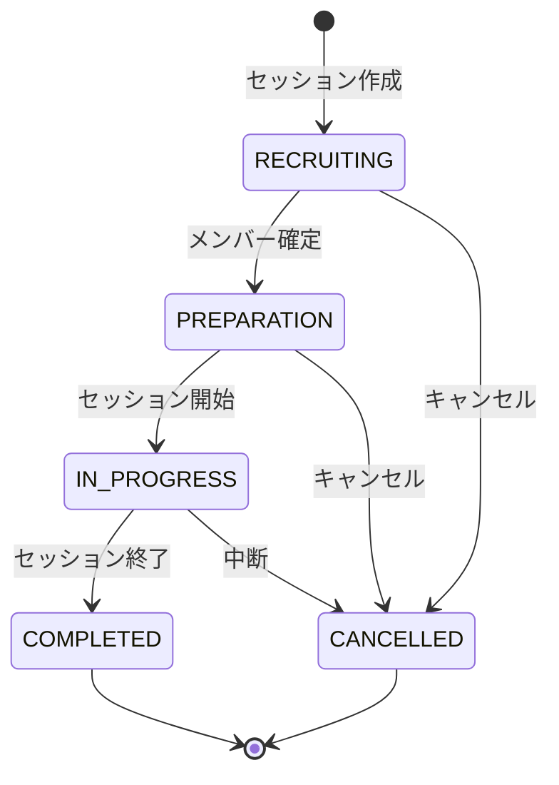

# シナプレ管理くん 詳細要件定義書（v1）

- [シナプレ管理くん 詳細要件定義書（v1）](#シナプレ管理くん-詳細要件定義書v1)
  - [1. プロジェクトビジョン](#1-プロジェクトビジョン)
    - [1.1 ミッション](#11-ミッション)
    - [1.2 コアバリュー](#12-コアバリュー)
    - [1.3 ターゲットユーザー](#13-ターゲットユーザー)
  - [2. 技術スタック](#2-技術スタック)
  - [3. ユーザーモデル](#3-ユーザーモデル)
    - [3.1 ユーザー種別と権限](#31-ユーザー種別と権限)
    - [3.2 ユーザー属性](#32-ユーザー属性)
    - [3.3 ユーザーストーリー](#33-ユーザーストーリー)
  - [4. シナリオ管理](#4-シナリオ管理)
    - [4.1 シナリオ属性](#41-シナリオ属性)
    - [4.2 ハンドアウト形式](#42-ハンドアウト形式)
    - [4.3 シナリオシステム](#43-シナリオシステム)
    - [4.4 タグ](#44-タグ)
    - [4.5 ユーザーストーリー](#45-ユーザーストーリー)
  - [5. シナリオ検索（最重要機能）](#5-シナリオ検索最重要機能)
    - [5.1 設計思想](#51-設計思想)
      - [UX原則](#ux原則)
      - [ユーザーの検索パターン](#ユーザーの検索パターン)
    - [5.2 検索UI構成](#52-検索ui構成)
      - [UI補足](#ui補足)
    - [5.3 検索条件の分類](#53-検索条件の分類)
      - [必須条件](#必須条件)
      - [検索条件一覧](#検索条件一覧)
      - [システム選択の挙動](#システム選択の挙動)
    - [5.4 検索ロジック](#54-検索ロジック)
      - [フィルタリング（絞り込み）](#フィルタリング絞り込み)
      - [絞り込みルール](#絞り込みルール)
      - [人数・時間の「範囲重複」判定](#人数時間の範囲重複判定)
    - [5.5 ソートオプション](#55-ソートオプション)
    - [5.6 検索結果の表示](#56-検索結果の表示)
      - [結果件数の制御](#結果件数の制御)
      - [0件の場合](#0件の場合)
      - [カード表示情報](#カード表示情報)
    - [5.7 UI状態管理](#57-ui状態管理)
      - [URL同期](#url同期)
      - [詳細条件の開閉状態](#詳細条件の開閉状態)
    - [5.8 ユーザーストーリー](#58-ユーザーストーリー)
    - [5.9 旧仕様からの変更点](#59-旧仕様からの変更点)
    - [5.10 バリデーション仕様](#510-バリデーション仕様)
    - [5.11 エッジケース](#511-エッジケース)
    - [5.12 日本語検索の正規化](#512-日本語検索の正規化)
  - [6. セッション管理](#6-セッション管理)
    - [6.1 セッション属性](#61-セッション属性)
    - [6.2 セッションフェーズ](#62-セッションフェーズ)
    - [6.3 参加者管理](#63-参加者管理)
      - [参加者タイプ](#参加者タイプ)
      - [参加者ステータス](#参加者ステータス)
      - [参加者属性](#参加者属性)
    - [6.4 日程調整](#64-日程調整)
      - [スケジュールフェーズ](#スケジュールフェーズ)
      - [日程調整フロー](#日程調整フロー)
    - [6.5 ユーザーストーリー](#65-ユーザーストーリー)
  - [7. レビューシステム](#7-レビューシステム)
    - [7.1 レビュー属性](#71-レビュー属性)
    - [7.2 レビュー投稿条件](#72-レビュー投稿条件)
    - [7.3 レビュー表示](#73-レビュー表示)
      - [シナリオ詳細ページ](#シナリオ詳細ページ)
      - [表示順](#表示順)
    - [7.4 ユーザーストーリー](#74-ユーザーストーリー)
  - [8. シナリオ経験管理（userScenarioPreferences）](#8-シナリオ経験管理userscenariopreferences)
    - [8.1 経験属性](#81-経験属性)
    - [8.2 用途](#82-用途)
    - [8.3 ユーザーストーリー](#83-ユーザーストーリー)
  - [9. 動画リンク管理](#9-動画リンク管理)
    - [9.1 動画リンク属性](#91-動画リンク属性)
    - [9.2 登録条件](#92-登録条件)
    - [9.3 ユーザーストーリー](#93-ユーザーストーリー)
  - [10. シナリオ詳細ページ（/scenarios/\[id\]）](#10-シナリオ詳細ページscenariosid)
    - [10.1 ページの目的と優先シーン](#101-ページの目的と優先シーン)
    - [10.2 ページ構成](#102-ページ構成)
    - [10.3 アクションメニュー](#103-アクションメニュー)
      - [上部ヘッダー（追従しない）](#上部ヘッダー追従しない)
      - [右下FAB（固定）](#右下fab固定)
      - [メニュー項目](#メニュー項目)
    - [10.4 ファーストビュー（スクロールなしで見える範囲）](#104-ファーストビュースクロールなしで見える範囲)
      - [必須表示項目](#必須表示項目)
      - [概要の展開仕様](#概要の展開仕様)
    - [10.5 関連セッションセクション](#105-関連セッションセクション)
      - [表示条件](#表示条件)
      - [セッションカード表示内容](#セッションカード表示内容)
    - [10.6 プレイ動画セクション](#106-プレイ動画セクション)
      - [表示形式: カード形式](#表示形式-カード形式)
      - [対応プラットフォーム](#対応プラットフォーム)
      - [Spoiler機能](#spoiler機能)
    - [10.7 レビューセクション](#107-レビューセクション)
      - [表示件数とページネーション](#表示件数とページネーション)
      - [ソート・フィルタUI](#ソートフィルタui)
      - [ソートオプション](#ソートオプション)
      - [レビューカード構成](#レビューカード構成)
      - [ボタン配置](#ボタン配置)
      - [非表示機能](#非表示機能)
      - [投稿条件](#投稿条件)
    - [10.8 ネタバレ保護](#108-ネタバレ保護)
      - [デフォルト動作](#デフォルト動作)
      - [ネタバレ配慮が必要な要素](#ネタバレ配慮が必要な要素)
    - [10.9 権限制御](#109-権限制御)
    - [10.10 データベース操作](#1010-データベース操作)
      - [必要なクエリ](#必要なクエリ)
      - [更新処理](#更新処理)
    - [10.11 ユーザーストーリー](#1011-ユーザーストーリー)
  - [11. セッション一覧ページ（/sessions）](#11-セッション一覧ページsessions)
    - [11.1 ページの目的](#111-ページの目的)
    - [11.2 タブ構成](#112-タブ構成)
    - [11.3 全体レイアウト](#113-全体レイアウト)
    - [11.4 参加予定タブ](#114-参加予定タブ)
      - [表示対象](#表示対象)
      - [カード表示情報](#カード表示情報-1)
      - [カレンダー表示](#カレンダー表示)
      - [ソートオプション](#ソートオプション-1)
    - [11.5 参加履歴タブ](#115-参加履歴タブ)
      - [表示対象](#表示対象-1)
      - [カード表示情報](#カード表示情報-2)
      - [フィルタ・ソート](#フィルタソート)
    - [11.6 公開卓を探すタブ](#116-公開卓を探すタブ)
      - [表示対象](#表示対象-2)
      - [検索条件](#検索条件)
      - [カード表示情報](#カード表示情報-3)
      - [ソートオプション](#ソートオプション-2)
      - [ネタバレ保護](#ネタバレ保護)
    - [11.7 権限制御](#117-権限制御)
    - [11.8 UI詳細](#118-ui詳細)
      - [セッションカード（公開卓）](#セッションカード公開卓)
      - [セッションカード（自分のセッション）](#セッションカード自分のセッション)
      - [カレンダービュー](#カレンダービュー)
      - [0件時の表示](#0件時の表示)
    - [11.9 URL設計・状態管理](#119-url設計状態管理)
      - [URL構成](#url構成)
      - [クエリパラメータ](#クエリパラメータ)
    - [11.10 ユーザーストーリー](#1110-ユーザーストーリー)
  - [12. 画面一覧](#12-画面一覧)
    - [12.1 認証系](#121-認証系)
    - [12.2 メイン系](#122-メイン系)
    - [12.3 ダッシュボード（/home）](#123-ダッシュボードhome)
  - [13. 画面遷移図](#13-画面遷移図)
  - [14. 非機能要件](#14-非機能要件)
    - [14.1 パフォーマンス](#141-パフォーマンス)
    - [14.2 セキュリティ](#142-セキュリティ)
    - [14.3 ユーザビリティ](#143-ユーザビリティ)
    - [14.4 運用](#144-運用)
  - [15. 非要件（スコープ外）](#15-非要件スコープ外)
  - [16. 将来検討事項](#16-将来検討事項)
  - [17. 用語集](#17-用語集)
  - [18. 実装指示](#18-実装指示)

---

## 1. プロジェクトビジョン

### 1.1 ミッション
TRPGプレイヤーが**快適にセッションを計画・実行**し、**思い出を振り返れる**Webアプリケーションを提供する。

### 1.2 コアバリュー
1. **セッション体験の向上** - 日程調整・参加者管理の煩雑さを解消
2. **思い出の記録** - プレイ履歴・動画・レビューを一元管理
3. **シナリオ発見** - 次に遊ぶシナリオを効率的に見つける
4. **安心・安全** - 荒らし防止、ネタバレ保護を徹底

### 1.3 ターゲットユーザー
- 日本のTRPGプレイヤー（主にオンラインセッション）
- 週1〜月数回セッションを行うアクティブプレイヤー
- 複数のシステム（CoC、SW2.5、インセイン等）を遊ぶ層

---

## 2. 技術スタック

| カテゴリ | 技術 | 備考 |
|---------|------|------|
| Framework | Next.js 16 | App Router, Turbopack |
| Database | PostgreSQL (Supabase) | - |
| DBクライアント | Supabase JS Client | REST API/RPC |
| Styling | PandaCSS | @/styled-system/* |
| UI | Ark UI | + カスタムコンポーネント |
| 認証 | Discord OAuth | 将来的にGoogle追加検討 |
| ID生成 | ULID | 26文字 |
| Lint/Format | Biome | シングルクォート、2スペース |
| Testing | Vitest + Storybook + agent-browser | - |

---

## 3. ユーザーモデル

### 3.1 ユーザー種別と権限

| 種別 | 権限 | 条件 |
|------|------|------|
| 未ログインユーザー | シナリオ検索・閲覧のみ | - |
| MEMBER | 閲覧・セッション参加・レビュー投稿 | Discord認証済み |
| MODERATOR | 不適切コンテンツの編集・削除 | 管理者が付与 |

### 3.2 ユーザー属性

| フィールド | 型 | 必須 | 説明 |
|-----------|-----|------|------|
| userId | ULID | ○ | 主キー |
| discordId | string | ○ | Discord連携用（ユニーク） |
| userName | string | ○ | システム内一意のID（変更可） |
| nickname | string | ○ | 表示名 |
| bio | string | - | 自己紹介（500文字以内） |
| image | string | - | プロフィール画像URL |
| role | enum | ○ | MEMBER / MODERATOR |
| lastloginAt | timestamp | - | 最終ログイン日時 |

### 3.3 ユーザーストーリー

```
US-001: ユーザーとして、Discordアカウントでログインできる
US-002: ユーザーとして、プロフィールを編集できる
US-003: ユーザーとして、自分の参加セッション履歴を確認できる
US-004: ユーザーとして、自分のレビュー履歴を確認できる
US-005: ユーザーとして、お気に入りシナリオを管理できる
```

---

## 4. シナリオ管理

### 4.1 シナリオ属性

| フィールド | 型 | 必須 | 説明 |
|-----------|-----|------|------|
| scenarioId | ULID | ○ | 主キー |
| name | string | ○ | シナリオ名（100文字以内） |
| scenarioSystemId | FK | ○ | 対象システム |
| author | string | - | 作者名 |
| description | text | - | 概要（2000文字以内） |
| scenarioImageUrl | string | - | サムネイル画像URL |
| minPlayer | integer | - | 最小プレイ人数 |
| maxPlayer | integer | - | 最大プレイ人数 |
| minPlaytime | integer | - | 最小プレイ時間（分） |
| maxPlaytime | integer | - | 最大プレイ時間（分） |
| handoutType | enum | ○ | NONE / PUBLIC / SECRET |
| distributeUrl | string | - | 配布URL（Booth等） |
| createdById | FK | - | 登録者（null可） |

### 4.2 ハンドアウト形式

| 値 | 説明 |
|----|------|
| NONE | ハンドアウトなし |
| PUBLIC | 公開ハンドアウト（全員閲覧可） |
| SECRET | 秘匿ハンドアウト（個別配布） |

### 4.3 シナリオシステム

事前に管理者が登録。ユーザーからの追加リクエスト機能は将来検討。

| 例 |
|----|
| クトゥルフ神話TRPG（CoC6版） |
| 新クトゥルフ神話TRPG（CoC7版） |
| ソード・ワールド2.5 |
| インセイン |
| エモクロアTRPG |
| シノビガミ |

### 4.4 タグ

- シナリオに複数のタグを付与可能
- タグは管理者が事前登録（荒らし防止）
- 将来的にユーザー提案 → 承認フローを検討

| タグ例 |
|--------|
| ホラー |
| ほのぼの |
| 推理 |
| バトル |
| 短時間 |
| 初心者向け |

### 4.5 ユーザーストーリー

```
US-101: ユーザーとして、シナリオを検索できる
US-102: ユーザーとして、シナリオ詳細を閲覧できる
US-103: ユーザーとして、新規シナリオを登録できる
US-104: シナリオ登録者として、自分が登録したシナリオを編集できる
US-105: MODERATORとして、任意のシナリオを編集・削除できる
```

---

## 5. シナリオ検索（最重要機能）

### 5.1 設計思想

#### UX原則
1. **最小入力で検索開始**: システム選択だけで検索可能
2. **段階的詳細化**: 必要に応じて条件を追加
3. **結果から絞り込み**: 検索後にフィルタで調整
4. **モード切替不要**: 単一の検索フローで完結

#### ユーザーの検索パターン
| パターン | 例 | 対応 |
|----------|-----|------|
| 具体的検索 | 「4人で3時間のCoC7版」 | 条件指定 |
| ブラウジング | 「CoC7版で面白そうなの」 | システムのみ |
| テーマ検索 | 「ホラー系がいい」 | タグ検索 |
| 名前検索 | 「あのシナリオなんだっけ」 | シナリオ名検索 |

### 5.2 検索UI構成

```
┌─────────────────────────────────────────────────────┐
│ 検索パネル（常時表示）                                │
│ ┌─────────────────────────────────────────────────┐ │
│ │ システム: [CoC6版 ✕][CoC7版 ✕][+ 追加]          │ │
│ │           ※ 未選択時は全システム対象             │ │
│ │                                                 │ │
│ │ プレイ人数: [指定なし ▼] または [3]〜[5] 人      │ │
│ │ プレイ時間: [指定なし ▼] または [3]〜[6] 時間    │ │
│ │ タグ:       [ホラー ✕][推理 ✕][+ 追加]          │ │
│ │                                                 │ │
│ │ シナリオ名: [____________] （部分一致）          │ │
│ │                                                 │ │
│ │ [検索]  [条件クリア]                            │ │
│ └─────────────────────────────────────────────────┘ │
├─────────────────────────────────────────────────────┤
│ 検索結果: 42件                                      │
│ ソート: [新着順 ▼] [高評価順] [プレイ時間順]        │
│                                                     │
│ ┌─────────┐ ┌─────────┐ ┌─────────┐               │
│ │ Card    │ │ Card    │ │ Card    │               │
│ │ CoC7版  │ │ CoC6版  │ │ CoC7版  │               │
│ │ ★4.2   │ │ ★3.8   │ │ ★4.5   │               │
│ │ 3-4人   │ │ 4-5人   │ │ 2-3人   │               │
│ │ 4-6h    │ │ 3-4h    │ │ 2-3h    │               │
│ └─────────┘ └─────────┘ └─────────┘               │
│                                                     │
│ [もっと見る]                                        │
└─────────────────────────────────────────────────────┘
```

#### UI補足
- **システム/タグ**: チップ形式でマルチセレクト。✕ ボタンで個別削除可能
- **条件クリア**: 全条件を初期状態にリセット
- **検索ボタン**: 条件変更後にクリックで検索実行（または自動検索）

### 5.3 検索条件の分類

#### 必須条件
**なし** - すべての条件は任意。ただし結果件数を制御して大量表示を防ぐ。

#### 検索条件一覧
| 条件 | 入力形式 | デフォルト | 絞り込み挙動 |
|------|----------|------------|--------------|
| システム | マルチセレクト | 指定なし（全システム） | OR条件（選択したいずれかに一致） |
| プレイ人数 | 範囲指定 or 「指定なし」 | 指定なし | 範囲が重なるもの |
| プレイ時間 | 範囲指定 or 「指定なし」 | 指定なし | 範囲が重なるもの |
| タグ | マルチセレクト | なし | AND条件（全タグ含む） |
| シナリオ名 | テキスト | 空 | 部分一致 |

#### システム選択の挙動
- **未選択時**: 全システムが対象
- **単一選択**: そのシステムのみ
- **複数選択**: 選択したシステムのいずれかに一致（OR）

```
例: [CoC6版][CoC7版] を選択
  → CoC6版 OR CoC7版 のシナリオが表示される
```

### 5.4 検索ロジック

#### フィルタリング（絞り込み）
```typescript
type SearchParams = {
  systemIds?: string[];       // 任意（OR条件）
  playerCount?: {             // 任意
    min: number;
    max: number;
  };
  playtime?: {                // 任意（時間単位）
    min: number;
    max: number;
  };
  tagIds?: string[];          // 任意（AND条件）
  scenarioName?: string;      // 任意（部分一致）
};
```

#### 絞り込みルール
1. **システム**: 指定したいずれかに一致（OR）。未指定時は全システム対象
2. **プレイ人数**: シナリオの min_player 〜 max_player が指定範囲と重なるか
3. **プレイ時間**: シナリオの min_playtime 〜 max_playtime が指定範囲と重なるか
4. **タグ**: 指定した全タグを含む（AND）
5. **シナリオ名**: 部分一致（大文字小文字区別なし）
6. **全条件未指定時**: 全シナリオが対象（件数制限あり）

#### 人数・時間の「範囲重複」判定
```typescript
// シナリオが条件を満たすかどうか
function matchesRange(
  scenarioMin: number,
  scenarioMax: number,
  filterMin: number,
  filterMax: number
): boolean {
  // 範囲が重なっていればOK
  return scenarioMin <= filterMax && scenarioMax >= filterMin;
}

// 例: シナリオ「3-5人」、検索「4-6人」→ 重なる → ○
// 例: シナリオ「2-3人」、検索「4-6人」→ 重ならない → ✗
```

### 5.5 ソートオプション

| オプション | 説明 | デフォルト |
|------------|------|------------|
| 新着順 | 登録日時降順 | ○ |
| 高評価順 | 平均レビュー評価降順 | - |
| プレイ時間順（短い順） | min_playtime 昇順 | - |
| プレイ時間順（長い順） | min_playtime 降順 | - |

### 5.6 検索結果の表示

#### 結果件数の制御
- 初期表示: 20件
- 「もっと見る」で20件ずつ追加読み込み（無限スクロールまたはボタン）
- 最大表示: 100件（それ以上は条件追加を促す）

#### 0件の場合
```
┌─────────────────────────────────────────────────────┐
│ 検索結果: 0件                                       │
│                                                     │
│   条件に一致するシナリオが見つかりませんでした       │
│                                                     │
│   ・条件を緩めて再検索してみてください               │
│   ・お探しのシナリオを登録しませんか？               │
│                                                     │
│   [条件をリセット]  [シナリオを登録する]             │
└─────────────────────────────────────────────────────┘
```

#### カード表示情報
| 情報 | 表示例 | 優先度 |
|------|--------|--------|
| シナリオ名 | 「狂気山脈」 | 必須 |
| システム名 | CoC7版 | 必須 |
| 平均評価 | ★4.2 | 高 |
| プレイ人数 | 3-5人 | 高 |
| プレイ時間 | 4-6時間 | 高 |
| タグ | ホラー, 探索 | 中（2つまで表示） |
| サムネイル | 画像 | 中 |

### 5.7 UI状態管理

#### URL同期
検索条件はURLクエリパラメータに反映し、共有・ブックマーク可能にする。

```
/scenarios?system=coc7&players=3-5&time=3-6&tags=horror,mystery&q=狂気
```

#### 詳細条件の開閉状態
- デフォルト: 閉じた状態
- 条件が1つでも設定されている場合: 開いた状態で表示
- ユーザーの開閉操作: セッション中は維持（localStorageは不要）

### 5.8 ユーザーストーリー

```
US-201: ユーザーとして、システムを選ぶだけでシナリオ一覧を見られる
US-202: ユーザーとして、人数・時間で絞り込める
US-203: ユーザーとして、タグで絞り込める
US-204: ユーザーとして、シナリオ名で検索できる
US-205: ユーザーとして、検索結果を新着順・評価順でソートできる
US-206: ユーザーとして、検索条件をURLで共有できる
US-207: ユーザーとして、0件時にシナリオ登録に遷移できる
```

### 5.9 旧仕様からの変更点

| 項目 | 旧（v0） | 新（v1） | 理由 |
|------|----------|----------|------|
| 必須条件 | システム・人数・時間 | なし | 検索開始のハードルを下げる |
| システム選択 | 単一選択 | マルチセレクト | 「6版でも7版でもいい」に対応 |
| 完全一致モード | ON/OFFトグル | 廃止 | 概念が分かりにくいため |
| マッチ度計算 | 複雑なスコアリング | 廃止 | フィルタリングのみでシンプルに |
| 不一致理由表示 | カードに表示 | 廃止 | フィルタで除外されるため不要 |
| デフォルトソート | マッチ度順 | 新着順 | マッチ度廃止に伴い変更 |

### 5.10 バリデーション仕様

#### 入力値の範囲制約

| 項目 | 最小値 | 最大値 | 単位 | 備考 |
|------|--------|--------|------|------|
| プレイ人数 | 1 | 20 | 人 | 一般的なTRPGセッションの範囲 |
| プレイ時間 | 1 | 240 | 時間 | 複数日セッション（キャンペーン）に対応 |

#### min > max の場合

**バリデーションエラーとして処理する。**

```typescript
// 例: minPlayer: 5, maxPlayer: 3 → エラー
// フォーム送信時にバリデーションエラーを表示
// 「最小値は最大値以下にしてください」
```

#### 空文字列・null の変換

| 入力値 | 変換後 | 備考 |
|--------|--------|------|
| 空文字列 `""` | `undefined` | 数値フィールドのみ |
| `null` | `undefined` | フォーム初期値 |
| `undefined` | `undefined` | そのまま |

### 5.11 エッジケース

#### null値を持つシナリオの扱い

**null値のフィールドを持つシナリオは、そのフィールドの検索条件に関わらず常に検索結果に含める。**

| シナリオのフィールド | 検索条件 | 結果 |
|---------------------|----------|------|
| `minPlayer: null, maxPlayer: null` | プレイ人数: 3〜5人 | **含める** |
| `minPlaytime: null, maxPlaytime: null` | プレイ時間: 3〜6時間 | **含める** |
| `minPlayer: 3, maxPlayer: null` | プレイ人数: 4〜6人 | 範囲重複で判定 |

**理由**: 登録時に人数・時間が未設定のシナリオを検索から除外すると、ユーザーの発見機会が損なわれる。

```typescript
// 実装例
function matchesPlayerCount(
  scenario: { minPlayer: number | null; maxPlayer: number | null },
  filter: { min: number; max: number }
): boolean {
  // null値を持つシナリオは常に含める
  if (scenario.minPlayer === null || scenario.maxPlayer === null) {
    return true;
  }
  // 範囲重複判定
  return scenario.minPlayer <= filter.max && scenario.maxPlayer >= filter.min;
}
```

### 5.12 日本語検索の正規化

シナリオ名検索では、以下の正規化を適用して検索精度を向上させる。

#### 正規化ルール

| 変換 | 例 | 説明 |
|------|-----|------|
| ひらがな → カタカナ | くとぅるふ → クトゥルフ | 統一して比較 |
| カタカナ → ひらがな | クトゥルフ → くとぅるふ | （逆方向も対応） |
| 全角英数 → 半角 | ＣｏＣ → CoC | 統一して比較 |
| 半角カナ → 全角カナ | ｸﾄｩﾙﾌ → クトゥルフ | 統一して比較 |

#### 検索の挙動

```typescript
// 検索クエリ「くとぅるふ」で以下がヒット:
// - 「クトゥルフ神話TRPG」
// - 「くとぅるふ神話」
// - 「ｸﾄｩﾙﾌ」

// 検索クエリ「ＣｏＣ」で以下がヒット:
// - 「CoC7版シナリオ」
// - 「ＣｏＣ6版」
```

#### 実装方針

- 検索時に検索クエリとシナリオ名の両方を正規化
- PostgreSQLの `ILIKE` に加え、アプリケーション層で正規化処理
- 将来的に全文検索（`pg_trgm`）への移行も検討

---

## 6. セッション管理

### 6.1 セッション属性

| フィールド | 型 | 必須 | 説明 |
|-----------|-----|------|------|
| gameSessionId | ULID | ○ | 主キー |
| scenarioId | FK | ○ | 対象シナリオ |
| sessionPhase | enum | ○ | フェーズ |
| keeperId | FK | - | GM（Keeper）|

### 6.2 セッションフェーズ



| フェーズ | 説明 | 可能な操作 |
|----------|------|------------|
| RECRUITING | 参加者募集中 | 参加申請、日程調整 |
| PREPARATION | 準備中（メンバー確定） | キャラシ登録、最終調整 |
| IN_PROGRESS | セッション進行中 | - |
| COMPLETED | 完了 | レビュー投稿、動画登録 |
| CANCELLED | キャンセル | - |

### 6.3 参加者管理

#### 参加者タイプ
| タイプ | 説明 |
|--------|------|
| PLAYER | プレイヤー |
| SPECTATOR | 観戦者 |

#### 参加者ステータス
| ステータス | 説明 |
|------------|------|
| PENDING | 参加申請中 / 未確定 |
| CONFIRMED | 参加確定 |

#### 参加者属性
| フィールド | 型 | 説明 |
|-----------|-----|------|
| sessionId | FK | セッションID |
| userId | FK | ユーザーID |
| participantType | enum | PLAYER / SPECTATOR |
| participantStatus | enum | PENDING / CONFIRMED |
| characterSheetUrl | string | キャラクターシートURL |

### 6.4 日程調整

#### スケジュールフェーズ
| フェーズ | 説明 |
|---------|------|
| ADJUSTING | 候補日時を調整中 |
| CONFIRMED | 日程確定 |

#### 日程調整フロー
1. GM が候補日時を複数提示
2. 参加者が各候補に対して可否を回答
3. GM が最適な日時を確定
4. 全員に通知

※ 候補日時と回答は JSONB で保持（将来実装）

### 6.5 ユーザーストーリー

```
US-301: GMとして、新規セッションを作成できる
US-302: GMとして、参加者を募集できる
US-303: ユーザーとして、セッションに参加申請できる
US-304: GMとして、参加者を承認/拒否できる
US-305: 参加者として、キャラクターシートURLを登録できる
US-306: GMとして、日程候補を提示できる
US-307: 参加者として、日程候補に可否を回答できる
US-308: GMとして、日程を確定できる
US-309: GMとして、セッションフェーズを進められる
US-310: 参加者として、セッション完了後にレビューを投稿できる
```

---

## 7. レビューシステム

### 7.1 レビュー属性

| フィールド | 型 | 必須 | 説明 |
|-----------|-----|------|------|
| userReviewId | ULID | ○ | 主キー |
| userId | FK | ○ | 投稿者 |
| scenarioId | FK | ○ | 対象シナリオ |
| sessionId | FK | - | 紐づくセッション |
| rating | integer | - | 評価（1〜5） |
| openComment | text | - | 公開コメント（ネタバレなし） |
| spoilerComment | text | - | スポイラーコメント（折りたたみ表示） |

### 7.2 レビュー投稿条件

- **必須条件**: そのシナリオのセッションに参加済み（COMPLETED）
- 1ユーザー1シナリオにつき1レビューまで（ユニーク制約）
- 編集・削除は本人のみ可能

### 7.3 レビュー表示

#### シナリオ詳細ページ
- 平均評価（星表示）
- レビュー件数
- 公開コメント一覧
- スポイラーコメント（折りたたみ）

#### 表示順
- 新着順（デフォルト）
- 高評価順
- 低評価順

### 7.4 ユーザーストーリー

```
US-401: 参加者として、セッション完了後にレビューを投稿できる
US-402: ユーザーとして、シナリオのレビュー一覧を閲覧できる
US-403: ユーザーとして、スポイラーを展開して閲覧できる
US-404: レビュー投稿者として、自分のレビューを編集できる
US-405: レビュー投稿者として、自分のレビューを削除できる
```

---

## 8. シナリオ経験管理（userScenarioPreferences）

### 8.1 経験属性

| フィールド | 型 | 説明 |
|-----------|-----|------|
| scenarioId | FK | シナリオID |
| userId | FK | ユーザーID |
| sessionId | FK | 紐づくセッション（任意） |
| isPlayed | boolean | プレイ済みか |
| isWatched | boolean | 観戦/動画視聴済みか |
| canKeeper | boolean | GMできるか |
| hadScenario | boolean | シナリオを所持しているか |
| isLike | boolean | お気に入り登録 |

### 8.2 用途

- **ネタバレ保護**: 未プレイユーザーへの配慮
- **GM募集**: canKeeper = true のユーザーを探す
- **マッチング**: 同じシナリオ経験者を避ける
- **お気に入り**: 気になるシナリオをブックマーク

### 8.3 ユーザーストーリー

```
US-501: ユーザーとして、シナリオを「プレイ済み」に設定できる
US-502: ユーザーとして、シナリオを「GMできる」に設定できる
US-503: ユーザーとして、シナリオを「お気に入り」に追加できる
US-504: ユーザーとして、自分の経験シナリオ一覧を確認できる
```

---

## 9. 動画リンク管理

### 9.1 動画リンク属性

| フィールド | 型 | 必須 | 説明 |
|-----------|-----|------|------|
| videoLinkId | ULID | ○ | 主キー |
| scenarioId | FK | ○ | シナリオID |
| sessionId | FK | ○ | セッションID |
| videoUrl | string | ○ | 動画URL（ユニーク） |
| createdById | FK | ○ | 登録者 |

### 9.2 登録条件

- セッション参加者のみ登録可能
- YouTube, Twitchなどの動画プラットフォームURL
- 同一URLの重複登録不可

### 9.3 ユーザーストーリー

```
US-601: セッション参加者として、録画動画を登録できる
US-602: ユーザーとして、シナリオの関連動画を閲覧できる
US-603: ユーザーとして、セッションの録画動画を閲覧できる
```

---

## 10. シナリオ詳細ページ（/scenarios/[id]）

### 10.1 ページの目的と優先シーン

シナリオ詳細ページを訪れるユーザーの主なシーンと優先順位:

| 優先度 | シーン | ユーザーの目的 |
|--------|--------|---------------|
| A（最高） | 検索から来た人 | 詳細確認して「遊ぶかどうか」を判断、レビューで評判確認 |
| C（高） | GMをやりたい人 | このシナリオでセッションを立てたい |
| B（中） | プレイ済みの人 | レビュー投稿、録画動画を登録、振り返り |

※ 振り返りシーン: Discordでシナリオの話になったとき、関連セッションから詳細を確認

### 10.2 ページ構成

```
┌─────────────────────────────────────────────────────┐
│ [←] シナリオ名                             ★お気に入り  │ ← ヘッダー（追従しない）
├─────────────────────────────────────────────────────┤
│ [1] ファーストビュー                                 │
│     サムネ、システム、評価、人数、時間、作者、タグ   │
│     概要（3行 + 展開）、ハンドアウト形式、配布URL   │
├─────────────────────────────────────────────────────┤
│ [2] 関連セッション                                   │
├─────────────────────────────────────────────────────┤
│ [3] プレイ動画                                       │
├─────────────────────────────────────────────────────┤
│ [4] レビュー                                         │
└─────────────────────────────────────────────────────┘
                                                ┌───┐
                                                │ ≡ │ ← 右下FAB
                                                └───┘
```

### 10.3 アクションメニュー

#### 上部ヘッダー（追従しない）
| 要素 | 説明 |
|------|------|
| [←] 戻るボタン | 前のページへ |
| シナリオ名 | h1タイトル |
| ★お気に入り | トグルボタン（初見へのヒント） |

#### 右下FAB（固定）
- **位置**: 画面右下固定
- **機能**: ドロップダウンメニュー表示(ボタンの上左にfadein)
- **状態**: メニュー非表示(≡) → メニュー表示(x)

#### メニュー項目
| 項目 | 説明 | 権限 |
|------|------|------|
| セッション作成 | `/sessions/new?scenarioId=[id]` へ遷移 | ログイン済み |
| プレイ済み登録 | `isPlayed` をトグル | ログイン済み |
| シナリオ編集 | `/scenarios/[id]/edit` へ遷移 | 登録者/MODERATOR |
| シェア | URLをクリップボードにコピー | 全員 |

### 10.4 ファーストビュー（スクロールなしで見える範囲）

#### 必須表示項目
| 項目 | 表示形式 | データソース |
|------|----------|------------|
| サムネイル | 画像 | `scenarioImageUrl` |
| シナリオ名 | h1 | `name` |
| システム名 | バッジ | `scenarioSystems.name` |
| 平均評価 | ★4.2（42件） | `userReviews`から集計 |
| プレイ人数 | 3-5人 | `minPlayer` - `maxPlayer` |
| プレイ時間 | 4-6時間 | `minPlaytime` - `maxPlaytime` |
| 作者名 | テキスト | `author` |
| タグ | チップ | `tags`テーブル |
| 概要 | 3行 + 「続きを読む」 | `description` |
| ハンドアウト形式 | バッジ | `handoutType` |
| 配布URL | リンクボタン | `distributeUrl` |

#### 概要の展開仕様
- **初期表示**: 最初の3行のみちゃんと表示、4行目からはoverflow: hideで隠しつつ、maskでfadeoutで続きがあるのを匂わせる。
- **展開方法**: 「続きを読む」ボタンをクリック
- **展開後**: 全文表示 + 「閉じる」ボタン

### 10.5 関連セッションセクション

#### 表示条件
- `sessionPhase = COMPLETED` のセッションのみ表示
- 振り返り用途: セッション詳細で参加メンバー・キャラシ等を確認可能

#### セッションカード表示内容
| 項目 | 説明 |
|------|------|
| プレイ日 | セッション確定日時 |
| 卓名 | 〇〇の卓(`session.sessionName`) |
| 参加者数 | `sessionParticipants` のカウント |

### 10.6 プレイ動画セクション

#### 表示形式: カード形式
| 項目 | 説明 |
|------|------|
| サムネイル | 動画プラットフォームから取得 |
| タイトル | 動画タイトル |
| 投稿日 | 動画の投稿日時 |
| プラットフォームアイコン | YouTube / ニコニコ動画 |

#### 対応プラットフォーム
- YouTube（メイン）
- ニコニコ動画（サブ）

#### Spoiler機能
- **目的**: 動画サムネイルによるネタバレ防止
- **機能**: 動画サムネイルを強めのblurで隠す
- **デフォルト**: プレイ動画紐づけ時の設定を参照`videoLinks.spoiler`
- **切り替え**: 動画サムネイルの真ん中である「ネタバレ」スイッチでBlur解除

### 10.7 レビューセクション

#### 表示件数とページネーション
- **初期表示**: 10件
- **追加読み込み**: 「もっと見る」ボタン

#### ソート・フィルタUI
フィルタパネル形式で表示:
```
┌─────────────────────────────────────────────────────┐
│ レビュー（42件）                                     │
│ ┌─────────────────────────────────────────────────┐ │
│ │ ソート: [新着順 ▼]                              │ │
│ │ [非表示コメントを表示]                          │ │
│ └─────────────────────────────────────────────────┘ │
```

#### ソートオプション
- 新着順（デフォルト）
- 高評価順
- 低評価順

#### レビューカード構成
```
┌─────────────────────────────────────────────────────┐
│ ★★★★☆  4.0                    [編集][非表示]     │ ← 右上にボタン
│ ユーザー名  @username  2026-01-15                  │
├─────────────────────────────────────────────────────┤
│ 【公開コメント】                                     │
│ とても面白かったです。推理パートが...               │
│                                                     │
│ 【ネタバレコメント】                                 │
│ ▼ ネタバレを表示する  ← クリックで同一カード内展開  │
└─────────────────────────────────────────────────────┘
```

#### ボタン配置
| ボタン | 位置 | 表示条件 |
|--------|------|----------|
| 編集 | カード右上 | コメント投稿者のみ |
| 非表示 | カード右上 | 全員（不快なレビューを隠す） |
| ネタバレ表示 | ネタバレコメント部分 | スポイラーコメントがある場合 |

#### 非表示機能
- **保存方式**: 永続保存（DB または localStorage）
- **再表示**: レビュー一覧上部の「非表示コメントを表示」ボタン

#### 投稿条件
- セッション完了済み（`sessionPhase = COMPLETED`）参加者のみ
- 1ユーザー1シナリオにつき1件まで（ユニーク制約）
- 編集・削除は本人のみ可能

### 10.8 ネタバレ保護

#### デフォルト動作
- **ネタバレ非表示モード**がデフォルト
- スポイラーコメント: 折りたたみ状態
- 動画サムネイル: Spoiler機能でぼかし/隠し

#### ネタバレ配慮が必要な要素
| 要素 | 配慮 |
|------|------|
| シナリオ概要 | 不要（作者が書いた公開情報） |
| タグ | 不要 |
| レビュー公開コメント | 不要（ネタバレなしが前提） |
| レビュースポイラーコメント | 必要（折りたたみ） |
| 動画サムネイル | 必要（Spoiler機能） |

### 10.9 権限制御

| 要素 | 未ログイン | MEMBER | 登録者 | MODERATOR |
|------|-----------|--------|--------|-----------|
| 基本情報閲覧 | ○ | ○ | ○ | ○ |
| お気に入り登録 | - | ○ | ○ | ○ |
| 経験登録 | - | ○ | ○ | ○ |
| セッション作成 | - | ○ | ○ | ○ |
| レビュー閲覧 | ○ | ○ | ○ | ○ |
| レビュー投稿 | - | ○※ | ○※ | ○※ |
| シナリオ編集 | - | - | ○ | ○ |

※ セッション完了済み参加者のみ

### 10.10 データベース操作

#### 必要なクエリ
1. シナリオ基本情報 + システム + タグ（リレーション込み）
2. 平均評価・レビュー件数の集計
3. ユーザーの経験登録状態（`userScenarioPreferences`）
4. レビュー一覧（ソート付き、10件 + ページネーション）
5. 関連セッション一覧（`sessionPhase = COMPLETED`）
6. 関連動画一覧

#### 更新処理
- お気に入り登録のトグル（`isLike` の UPDATE/INSERT）
- 経験登録のトグル（`userScenarioPreferences` の UPDATE/INSERT）
- レビュー非表示設定の保存

### 10.11 ユーザーストーリー

```
US-106: ユーザーとして、シナリオ詳細を閲覧できる
US-107: ログインユーザーとして、シナリオからセッションを作成できる
US-108: ログインユーザーとして、シナリオをお気に入り登録できる
US-109: ログインユーザーとして、シナリオの経験（プレイ済み・GMできる等）を登録できる
US-110: ユーザーとして、シナリオのレビューを閲覧できる
US-111: ユーザーとして、スポイラーコメントを展開して閲覧できる
US-112: ユーザーとして、不快なレビューを非表示にできる
US-113: ユーザーとして、シナリオの関連セッションを確認できる
US-114: ユーザーとして、シナリオの関連動画を閲覧できる
US-115: ユーザーとして、動画のネタバレ表示を切り替えられる
US-116: 登録者・MODERATORとして、シナリオを編集できる
```

---

## 11. セッション一覧ページ（/sessions）

### 11.1 ページの目的

ユーザーが自分の参加セッションを管理し、新しい公開セッションを発見できるページ。

**解決する課題**:
- 「今週のセッションいつだっけ？」→ 参加予定の確認
- 「前にやったあのセッションどうだったっけ？」→ 参加履歴の振り返り
- 「週末遊べる卓ないかな？」→ 公開卓の検索
- GMとして立てたセッションの進行管理

**対象ユーザー**:
| ペルソナ | 主な利用シーン |
|----------|---------------|
| 田中さん（週末GM） | セッション管理、公開卓の作成・管理 |
| 鈴木さん（新人PL） | 公開卓を探して参加申請 |
| 佐藤さん（配信者） | 過去セッションの振り返り、動画との紐付け確認 |
| 山田さん（ベテランKP） | 複数セッションの一括管理 |

### 11.2 タブ構成

| タブ | 表示条件 | 説明 |
|------|----------|------|
| 参加予定 | ログイン必須 | 今後参加予定のセッション（RECRUITING〜IN_PROGRESS） |
| 参加履歴 | ログイン必須 | 完了・キャンセル済みセッション（COMPLETED, CANCELLED） |
| 公開卓を探す | 全員 | 参加可能な公開セッション |

### 11.3 全体レイアウト

```
┌─────────────────────────────────────────────────────┐
│ セッション                      [+ セッション作成]  │ ← ヘッダー
├─────────────────────────────────────────────────────┤
│ [参加予定] [参加履歴] [公開卓を探す]               │ ← タブ
├─────────────────────────────────────────────────────┤
│ ┌─────────────────────────────────────────────────┐ │
│ │ フィルタ・検索エリア                           │ │
│ └─────────────────────────────────────────────────┘ │
├─────────────────────────────────────────────────────┤
│ [リスト] [カレンダー]  ← 表示切替（参加予定のみ）   │
├─────────────────────────────────────────────────────┤
│ ┌─────────┐ ┌─────────┐ ┌─────────┐               │
│ │ Card    │ │ Card    │ │ Card    │               │
│ └─────────┘ └─────────┘ └─────────┘               │
│                                                     │
│ [もっと見る]                                        │
└─────────────────────────────────────────────────────┘
```

### 11.4 参加予定タブ

#### 表示対象
自分が参加者（GM含む）として登録されているセッションで、以下のフェーズのもの:

| フェーズ | 表示 | 説明 |
|----------|------|------|
| RECRUITING | ○ | 募集中（日程未確定の可能性あり） |
| PREPARATION | ○ | 準備中（日程確定済み） |
| IN_PROGRESS | ○ | 進行中 |
| COMPLETED | - | 履歴タブへ |
| CANCELLED | - | 履歴タブへ |

#### カード表示情報
| 項目 | 表示例 | 優先度 |
|------|--------|--------|
| セッション日時 | 2026/01/25（土）19:00〜 | 必須 |
| シナリオ名 | 「狂気山脈」 | 必須 |
| システム名 | CoC7版 | 必須 |
| GM名 | GM: 田中太郎 | 必須 |
| フェーズバッジ | 募集中 / 準備中 / 進行中 | 必須 |
| 参加者数 | 3/4人 | 高 |
| 自分の役割 | GM / PL / 観戦 | 高 |

**日時未確定の場合**: 「日程調整中」と表示

#### カレンダー表示
| 要素 | 説明 |
|------|------|
| 表示形式 | 月間カレンダー |
| セッション表示 | 該当日にセッション名をドット/ラベル表示 |
| クリック時 | 該当日のセッション一覧をポップオーバーまたは下部に表示 |
| 日程未確定 | 「日程未確定」セクションに別途表示 |

#### ソートオプション
| オプション | 説明 | デフォルト |
|------------|------|------------|
| 開催日順 | セッション日時の近い順 | ○ |
| 登録日順 | セッション作成日の新しい順 | - |

### 11.5 参加履歴タブ

#### 表示対象
自分が参加者（GM含む）として登録されているセッションで、以下のフェーズのもの:

| フェーズ | 表示 | 説明 |
|----------|------|------|
| COMPLETED | ○ | 完了 |
| CANCELLED | ○ | キャンセル（別マーク表示） |

#### カード表示情報
| 項目 | 表示例 | 優先度 |
|------|--------|--------|
| セッション日時 | 2025/12/20（土） | 必須 |
| シナリオ名 | 「狂気山脈」 | 必須 |
| システム名 | CoC7版 | 必須 |
| GM名 | GM: 田中太郎 | 必須 |
| 完了/キャンセルバッジ | 完了 / キャンセル | 必須 |
| 参加者数 | 4人 | 中 |
| 自分の役割 | GM / PL / 観戦 | 中 |
| レビュー済みマーク | ✓ レビュー済み | 中 |
| 動画登録マーク | 📹 動画あり | 中 |

#### フィルタ・ソート
**フィルタ**:
| 条件 | 選択肢 |
|------|--------|
| 役割 | すべて / GM / PL / 観戦 |
| 状態 | すべて / 完了のみ / キャンセルのみ |
| システム | マルチセレクト |

**ソート**:
| オプション | 説明 | デフォルト |
|------------|------|------------|
| 開催日順（新しい順） | セッション日時の新しい順 | ○ |
| 開催日順（古い順） | セッション日時の古い順 | - |

### 11.6 公開卓を探すタブ

#### 表示対象
**デフォルト表示**:
| フェーズ | 表示 | 説明 |
|----------|------|------|
| RECRUITING | ○ | 参加募集中 |
| PREPARATION | ○ | 準備中（見学目的で表示） |

**フィルタで拡張可能**:
| フェーズ | 表示 | 説明 |
|----------|------|------|
| IN_PROGRESS | △ | 進行中（フィルタ選択時） |
| COMPLETED | △ | 完了（フィルタ選択時） |
| CANCELLED | - | 表示しない |

#### 検索条件
```
┌─────────────────────────────────────────────────────┐
│ 検索パネル                                          │
│ ┌─────────────────────────────────────────────────┐ │
│ │ システム: [CoC7版 ✕][+ 追加]                   │ │
│ │                                                 │ │
│ │ 開催日: [今週末 ▼] または [2026/01/20]〜[01/31] │ │
│ │        選択肢: 今週末 / 来週 / 今月 / 日付指定  │ │
│ │                                                 │ │
│ │ フェーズ: [募集中 ✓][準備中 ✓][進行中][完了]   │ │
│ │                                                 │ │
│ │ シナリオ名: [____________] （部分一致）         │ │
│ │                                                 │ │
│ │ [検索]  [条件クリア]                           │ │
│ └─────────────────────────────────────────────────┘ │
└─────────────────────────────────────────────────────┘
```

| 条件 | 入力形式 | デフォルト | 絞り込み挙動 |
|------|----------|------------|--------------|
| システム | マルチセレクト | 指定なし（全システム） | OR条件 |
| 開催日 | プリセット or 日付範囲 | 指定なし | 範囲内 |
| フェーズ | マルチセレクト | 募集中+準備中 | OR条件 |
| シナリオ名 | テキスト | 空 | 部分一致 |

#### カード表示情報
| 項目 | 表示例 | 優先度 |
|------|--------|--------|
| セッション日時 | 2026/01/25（土）19:00〜 | 必須 |
| シナリオ名 | 「狂気山脈」 | 必須 |
| システム名 | CoC7版 | 必須 |
| GM名 | GM: 田中太郎 | 必須 |
| フェーズバッジ | 募集中 / 準備中 | 必須 |
| 募集人数 | 残り1枠（3/4人） | 必須 |
| プレイ時間目安 | 約4-6時間 | 中 |

#### ソートオプション
| オプション | 説明 | デフォルト |
|------------|------|------------|
| 開催日順（近い順） | セッション日時の近い順 | ○ |
| 新着順 | セッション作成日の新しい順 | - |
| 残り枠順 | 空き枠の多い順 | - |

#### ネタバレ保護
| 要素 | 表示 | 理由 |
|------|------|------|
| シナリオ名 | ○ | 参加判断に必要 |
| システム名 | ○ | 参加判断に必要 |
| GM名 | ○ | 参加判断に必要 |
| 開催日時 | ○ | 参加判断に必要 |
| プレイ人数 | ○ | シナリオ情報だが判断に必要 |
| プレイ時間 | ○ | シナリオ情報だが判断に必要 |
| シナリオサムネイル | ✕ | ネタバレの可能性 |
| シナリオ概要 | ✕ | ネタバレの可能性 |
| タグ | ✕ | ネタバレの可能性 |
| レビュー | ✕ | ネタバレの可能性 |

**シナリオ詳細へのリンク**: 「シナリオ詳細を見る」リンクを別途配置（クリックでシナリオ詳細ページへ）

### 11.7 権限制御

| 機能 | 未ログイン | MEMBER | MODERATOR |
|------|-----------|--------|-----------|
| 公開卓を探すタブ閲覧 | ○ | ○ | ○ |
| 参加予定タブ閲覧 | - | ○ | ○ |
| 参加履歴タブ閲覧 | - | ○ | ○ |
| セッション作成 | - | ○ | ○ |
| セッション参加申請 | - | ○ | ○ |
| カレンダー表示 | - | ○ | ○ |

**未ログイン時の挙動**:
- 「参加予定」「参加履歴」タブはグレーアウト
- クリック時: ログインを促すダイアログ表示
- デフォルトで「公開卓を探す」タブを表示
- セッション作成ボタンは非表示

### 11.8 UI詳細

#### セッションカード（公開卓）
```
┌─────────────────────────────────────────────────────┐
│ [募集中] 2026/01/25（土）19:00〜                   │ ← フェーズ + 日時
│                                                     │
│ 狂気山脈                                            │ ← シナリオ名
│ CoC7版                                              │ ← システム名
│                                                     │
│ GM: 田中太郎                                        │ ← GM名
│ 残り1枠（3/4人）                                   │ ← 募集状況
│                                                     │
│ 約4-6時間                                          │ ← プレイ時間目安
└─────────────────────────────────────────────────────┘
```

#### セッションカード（自分のセッション）
```
┌─────────────────────────────────────────────────────┐
│ [準備中] 2026/01/25（土）19:00〜     [GM]          │ ← 自分の役割
│                                                     │
│ 狂気山脈                                            │
│ CoC7版                                              │
│                                                     │
│ 参加者: 4人                                         │
└─────────────────────────────────────────────────────┘
```

#### カレンダービュー
```
┌─────────────────────────────────────────────────────┐
│ ◀ 2026年1月 ▶                                      │
├────┬────┬────┬────┬────┬────┬────┤
│ 日 │ 月 │ 火 │ 水 │ 木 │ 金 │ 土 │
├────┼────┼────┼────┼────┼────┼────┤
│    │    │    │ 1  │ 2  │ 3  │ 4  │
├────┼────┼────┼────┼────┼────┼────┤
│ 5  │ 6  │ 7  │ 8  │ 9  │10  │11  │
│    │    │    │    │    │    │ ●  │ ← セッションあり
├────┼────┼────┼────┼────┼────┼────┤
│12  │13  │14  │15  │16  │17  │18  │
│    │    │    │    │    │    │ ●● │ ← 複数セッション
├────┴────┴────┴────┴────┴────┴────┤
│ 日程未確定のセッション: 2件                         │
│ ┌─────────────────────────────────────────────────┐ │
│ │ ・狂気山脈（募集中）                            │ │
│ │ ・インセイン短編（準備中）                      │ │
│ └─────────────────────────────────────────────────┘ │
└─────────────────────────────────────────────────────┘
```

#### 0件時の表示

**参加予定タブ（0件）**:
```
┌─────────────────────────────────────────────────────┐
│                                                     │
│   参加予定のセッションはありません                   │
│                                                     │
│   公開卓を探してみませんか？                         │
│                                                     │
│   [公開卓を探す]  [セッションを作成する]            │
│                                                     │
└─────────────────────────────────────────────────────┘
```

**参加履歴タブ（0件）**:
```
┌─────────────────────────────────────────────────────┐
│                                                     │
│   参加履歴はまだありません                           │
│                                                     │
│   セッションに参加して思い出を作りましょう！         │
│                                                     │
│   [公開卓を探す]                                    │
│                                                     │
└─────────────────────────────────────────────────────┘
```

**公開卓を探すタブ（0件）**:
```
┌─────────────────────────────────────────────────────┐
│                                                     │
│   条件に一致するセッションが見つかりませんでした     │
│                                                     │
│   ・条件を緩めて再検索してみてください               │
│   ・自分でセッションを立ててみませんか？             │
│                                                     │
│   [条件をリセット]  [セッションを作成する]          │
│                                                     │
└─────────────────────────────────────────────────────┘
```

### 11.9 URL設計・状態管理

#### URL構成
| パス | 説明 |
|------|------|
| `/sessions` | セッション一覧（デフォルト: 公開卓を探す） |
| `/sessions?tab=upcoming` | 参加予定タブ |
| `/sessions?tab=history` | 参加履歴タブ |
| `/sessions?tab=public` | 公開卓を探すタブ |

#### クエリパラメータ
| パラメータ | 説明 | 例 |
|-----------|------|-----|
| tab | アクティブタブ | `upcoming`, `history`, `public` |
| system | システムID（カンマ区切り） | `system=coc7,sw25` |
| from | 開催日（開始） | `from=2026-01-20` |
| to | 開催日（終了） | `to=2026-01-31` |
| phase | フェーズ（カンマ区切り） | `phase=recruiting,preparation` |
| q | シナリオ名検索 | `q=狂気` |
| view | 表示形式（参加予定のみ） | `view=calendar` |
| sort | ソート順 | `sort=date_asc`, `sort=created_desc` |
| role | 役割フィルタ（履歴のみ） | `role=gm`, `role=player` |

### 11.10 ユーザーストーリー

```
US-701: ユーザーとして、参加予定のセッション一覧を確認できる
US-702: ユーザーとして、参加予定をカレンダー形式で確認できる
US-703: ユーザーとして、参加履歴を確認できる
US-704: ユーザーとして、参加履歴を役割（GM/PL）でフィルタできる
US-705: ユーザーとして、公開セッションを検索できる
US-706: ユーザーとして、システムで公開セッションを絞り込める
US-707: ユーザーとして、開催日で公開セッションを絞り込める
US-708: ユーザーとして、シナリオ名で公開セッションを検索できる
US-709: ユーザーとして、セッション一覧から詳細ページに遷移できる
US-710: ユーザーとして、セッション一覧からセッションを作成できる
US-711: 未ログインユーザーとして、公開セッション一覧を閲覧できる
US-712: ユーザーとして、検索条件をURLで共有できる
```

---

## 12. 画面一覧

### 12.1 認証系

| 画面 | パス | 説明 |
|------|------|------|
| ログイン | /login | Discord OAuth |
| 新規登録 | /signup | 初回ログイン時のプロフィール設定 |

### 12.2 メイン系

| 画面 | パス | 説明 |
|------|------|------|
| ホーム | /home | ダッシュボード |
| シナリオ一覧 | /scenarios | 検索・一覧 |
| シナリオ詳細 | /scenarios/[id] | 詳細・レビュー |
| シナリオ登録 | /scenarios/new | 新規登録フォーム |
| シナリオ編集 | /scenarios/[id]/edit | 編集フォーム |
| セッション一覧 | /sessions | 自分の参加セッション |
| セッション詳細 | /sessions/[id] | 詳細・参加者 |
| セッション作成 | /sessions/new | 新規作成フォーム |
| ユーザー一覧 | /users | ユーザー検索 |
| ユーザー詳細 | /users/[id] | プロフィール・履歴 |
| マイページ | /users/me | 自分のプロフィール |

### 12.3 ダッシュボード（/home）

| セクション | 内容 |
|------------|------|
| 今週の予定 | 参加予定のセッション |
| 新着シナリオ | 最近登録されたシナリオ |
| おすすめ | よくプレイするシステム/タグのシナリオ |
| 最近の活動 | 自分の参加履歴・レビュー |

---

## 13. 画面遷移図

```
[未ログイン]
    │
    ├─→ /login ─→ Discord OAuth ─→ /home
    │
    └─→ /scenarios（閲覧のみ）
           │
           └─→ /scenarios/[id]（閲覧のみ）

[ログイン済み]
    │
    ├─→ /home（ダッシュボード）
    │      ├─→ 予定セッション → /sessions/[id]
    │      ├─→ 新着シナリオ → /scenarios/[id]
    │      └─→ おすすめ → /scenarios/[id]
    │
    ├─→ /scenarios
    │      ├─→ 検索 → 結果一覧
    │      ├─→ /scenarios/new → 登録完了 → /scenarios/[id]
    │      └─→ /scenarios/[id]
    │             ├─→ /scenarios/[id]/edit
    │             ├─→ セッション作成 → /sessions/new
    │             └─→ レビュー投稿
    │
    ├─→ /sessions
    │      ├─→ /sessions/[id]
    │      │      ├─→ 参加申請
    │      │      ├─→ 日程調整
    │      │      └─→ 動画登録
    │      └─→ /sessions/new → /sessions/[id]
    │
    └─→ /users
           ├─→ /users/[id]
           └─→ /users/me → 編集
```

---

## 14. 非機能要件

### 14.1 パフォーマンス

| 項目 | 目標値 |
|------|--------|
| 検索レスポンス | 1秒以内 |
| ページ初期表示 | 2秒以内 |
| 同時接続数 | 100ユーザー |

### 14.2 セキュリティ

- Discord OAuth 2.0 による認証
- CSRF対策（Next.js組み込み）
- XSS対策（React自動エスケープ）
- SQLインジェクション対策（Supabase REST API / パラメタライズドRPC）
- RLS（Row Level Security）によるデータ保護

### 14.3 ユーザビリティ

- **初見3秒ルール**: 画面を見て3秒以内に内容を把握できる
- **モバイル対応**: レスポンシブデザイン
- **アクセシビリティ**: Ark UIのアクセシビリティ準拠

### 14.4 運用

- Supabaseマネージドサービス利用
- 自動バックアップ（Supabase標準）
- エラーログ収集（将来実装）

---

## 15. 非要件（スコープ外）

| 項目 | 理由 |
|------|------|
| シナリオのバージョン管理 | シナリオは基本的に更新されない前提 |
| GM別評価 | 複雑化を避ける。レビューはシナリオ単位 |
| フリーフォームコメント欄 | 荒らし防止。構造化されたレビューのみ |
| リアルタイムチャット | 外部ツール（Discord等）を利用前提 |
| ダイスロール機能 | ココフォリア等の専用ツールを利用 |

※ 検索条件未指定時は結果件数を制限（20件）して対応

---

## 16. 将来検討事項

| 項目 | 優先度 | 備考 |
|------|--------|------|
| Google OAuth追加 | 中 | Discord以外の選択肢 |
| タグ提案機能 | 低 | ユーザー提案 → 承認フロー |
| シナリオインポート | 低 | Boothからの自動取得 |
| 通知機能 | 中 | セッション招待、日程確定通知 |
| PWA対応 | 低 | オフライン対応 |
| 多言語対応 | 低 | 現時点は日本語のみ |

---

## 17. 用語集

| 用語 | 説明 |
|------|------|
| シナリオ | TRPGの物語・ルールセット |
| システム | TRPGのルールブック（CoC、SW2.5等） |
| セッション | シナリオを遊ぶ1回のプレイ |
| GM/KP | ゲームマスター/キーパー（進行役） |
| PL | プレイヤー |
| ハンドアウト | PCに配布される情報シート |
| キャラシ | キャラクターシート |
| ネタバレ | シナリオの内容を事前に知ること |
| Booth | 同人作品販売サイト（シナリオの主要供給源） |
| ULID | ソート可能なユニークID |

---

## 18. 実装指示

1. 本要件定義書を唯一の仕様とする
2. 曖昧な解釈や補完判断を行わない
3. 不明点があれば必ず確認する
4. UIは情報量より理解速度を優先する
5. 初見3秒で内容が把握できる設計とする
6. 荒らし防止を常に意識する
